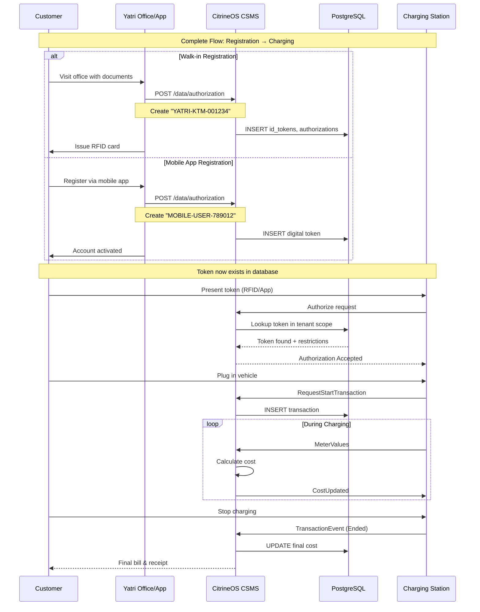

# Going to Production - Complete CSMS Implementation Guide

## 🎯 Production Goal

**Create multiple CPOs, add locations and chargers, enable EV driver authentication, manage charging transactions, implement billing, and provide detailed monitoring.**

---

## 📋 Implementation Checklist

### Phase 1: Infrastructure Setup ✅

- [x] CitrineOS Core running (Docker services)
- [x] Database initialized with multi-tenant support
- [x] API endpoints accessible at localhost:8080
- [x] GraphQL interface available at localhost:8090

### Phase 2: CPO Creation & Management 🔄

- [ ] Create Yatri Motorcycles CPO tenant
- [ ] Verify tenant isolation
- [ ] Create additional test CPO tenant

### Phase 3: Location & Charging Station Setup 🔄

- [ ] Create primary charging location
- [ ] Add charging stations to location
- [ ] Configure connectors and capabilities
- [ ] Verify station registration

### Phase 4: EV Driver Authentication 🔄

- [ ] Create ID token records
- [ ] Setup authorization rules
- [ ] Test authorization flow
- [ ] Configure local auth lists

### Phase 5: Transaction Management 🔄

- [ ] Configure billing tariffs
- [ ] Test remote start transaction
- [ ] Monitor transaction events
- [ ] Test remote stop transaction

### Phase 6: Monitoring & Analytics 🔄

- [ ] Setup real-time monitoring
- [ ] Test fleet management dashboard
- [ ] Verify transaction reporting
- [ ] Test cost calculation system

---

## 🚀 Step-by-Step Implementation

### STEP 1: Create Multiple CPOs

#### 1.1 Create Yatri Motorcycles CPO

```bash
# Test CitrineOS API availability
curl -X GET http://localhost:8080/health

# Create Yatri Motorcycles as CPO Tenant
curl -X POST http://localhost:8080/tenant/create \
  -H "Content-Type: application/json" \
  -d '{
    "name": "Yatri Motorcycles",
    "description": "Nepal EV Charging Network"
  }'
```

**Expected Response:**

```json
{
  "tenantId": 2,
  "name": "Yatri Motorcycles",
  "createdAt": "2025-01-22T10:00:00Z"
}
```

#### 1.2 Create Second CPO for Testing

```bash
# Create additional CPO tenant
curl -X POST http://localhost:8080/tenant/create \
  -H "Content-Type: application/json" \
  -d '{
    "name": "Nepal Charge Network",
    "description": "Secondary charging network for testing"
  }'
```

#### 1.3 Verify Tenant Isolation

```graphql
# Query via Hasura GraphQL (localhost:8090)
query GetTenants {
  tenants {
    id
    name
    createdAt
  }
}
```

---

### STEP 2: Create Locations with Charging Stations

#### 2.1 Kathmandu Mall Charging Hub

```bash
curl -X POST "http://localhost:8080/data/location?tenantId=2" \
  -H "Content-Type: application/json" \
  -d '{
    "name": "Kathmandu Mall Charging Hub",
    "address": "Ring Road, Kathmandu",
    "city": "Kathmandu",
    "postalCode": "44600",
    "state": "Bagmati",
    "country": "Nepal",
    "coordinates": {
      "type": "Point",
      "coordinates": [85.3240, 27.7172]
    },
    "chargingPool": [
      {
        "id": "yatri-ktm-001",
        "chargePointVendor": "Yatri",
        "chargePointModel": "YatriCharge-Pro-22kW",
        "chargePointSerialNumber": "YTR2025001",
        "firmwareVersion": "1.0.0"
      },
      {
        "id": "yatri-ktm-002",
        "chargePointVendor": "Yatri",
        "chargePointModel": "YatriCharge-Fast-50kW",
        "chargePointSerialNumber": "YTR2025002",
        "firmwareVersion": "1.0.0"
      }
    ]
  }'
```

#### 2.2 Pokhara Airport Charging Station

```bash
curl -X POST "http://localhost:8080/data/location?tenantId=2" \
  -H "Content-Type: application/json" \
  -d '{
    "name": "Pokhara Airport Charging Station",
    "address": "Pokhara Airport, Kaski",
    "city": "Pokhara",
    "postalCode": "33700",
    "state": "Gandaki",
    "country": "Nepal",
    "coordinates": {
      "type": "Point",
      "coordinates": [83.9822, 28.2096]
    },
    "chargingPool": [
      {
        "id": "yatri-pkr-001",
        "chargePointVendor": "Yatri",
        "chargePointModel": "YatriCharge-Ultra-150kW",
        "chargePointSerialNumber": "YTR2025003",
        "firmwareVersion": "1.0.0"
      }
    ]
  }'
```

#### 2.3 Add Individual Charging Station

```bash
curl -X POST "http://localhost:8080/data/charging-station?tenantId=2" \
  -H "Content-Type: application/json" \
  -d '{
    "id": "yatri-ktm-003",
    "locationId": 1,
    "chargePointVendor": "Yatri",
    "chargePointModel": "YatriCharge-Mobile-7kW",
    "chargePointSerialNumber": "YTR2025004",
    "firmwareVersion": "1.0.0"
  }'
```

#### 2.4 Verify Location Creation

```graphql
# Query locations with charging stations
query GetLocationsWithStations($tenantId: Int!) {
  locations(where: { tenantId: { _eq: $tenantId } }) {
    id
    name
    address
    coordinates
    chargingPool {
      id
      chargePointVendor
      chargePointModel
      isOnline
      protocol
    }
  }
}
```

---

### STEP 3: Setup EV Driver Authentication

> **Business Context**: Before any EV driver can charge, their ID token must exist in the CitrineOS database. We focus on 2 primary registration methods that cover Yatri's core use cases.

#### 3.1 Walk-in Customer Registration (Physical RFID Cards)

**Business Flow**: Customer visits Yatri office → Staff verifies identity → Creates account → Issues RFID card

```bash
# Customer: Ram Bahadur Sharma visits Kathmandu office
# Staff creates account and issues RFID card

curl -X POST "http://localhost:8080/data/authorization?tenantId=2" \
  -H "Content-Type: application/json" \
  -d '{
    "idToken": {
      "idToken": "YATRI-KTM-001234",
      "type": "ISO14443"
    },
    "idTokenInfo": {
      "status": "Accepted",
      "cacheExpiryDateTime": "2026-01-22T23:59:59Z",
      "personalMessage": {
        "format": "UTF8",
        "content": "Welcome to Yatri Network!"
      }
    },
    "allowedConnectorTypes": ["cType2", "cCCS2"],
    "concurrentTransaction": false,
    "customerDetails": {
      "name": "Ram Bahadur Sharma",
      "phone": "+977-9841234567",
      "email": "ram@example.com",
      "address": "Kathmandu, Nepal"
    }
  }'
```

**Token Format**: `YATRI-{CITY}-{SEQUENCE}` (e.g., YATRI-KTM-001234)
**Use Case**: Traditional customers, cash payments, immediate card issuance

#### 3.2 Mobile App Self-Registration (Digital Tokens)

**Business Flow**: User downloads app → Registers online → Payment verified → Digital token created

```bash
# User registers via Yatri mobile app
# Backend automatically creates digital token

curl -X POST "http://localhost:8080/data/authorization?tenantId=2" \
  -H "Content-Type: application/json" \
  -d '{
    "idToken": {
      "idToken": "MOBILE-USER-789012",
      "type": "Central"
    },
    "idTokenInfo": {
      "status": "Accepted",
      "cacheExpiryDateTime": "2025-12-31T23:59:59Z"
    },
    "allowedConnectorTypes": ["cType2", "cCCS2", "cChAdeMO"],
    "concurrentTransaction": true,
    "registrationMethod": "mobile_app",
    "customerDetails": {
      "deviceId": "ANDROID-DEVICE-123",
      "appVersion": "1.2.3"
    }
  }'
```

**Token Format**: `MOBILE-USER-{TIMESTAMP}` (e.g., MOBILE-USER-789012)
**Use Case**: Tech-savvy users, 24/7 registration, concurrent charging sessions

#### 3.3 Key Differences Between Registration Methods

| Feature                 | Walk-in Registration | Mobile App Registration      |
| ----------------------- | -------------------- | ---------------------------- |
| **Token Type**          | ISO14443 (RFID)      | Central (Digital)            |
| **Verification**        | Physical ID check    | Digital payment verification |
| **Availability**        | Office hours only    | 24/7                         |
| **Payment**             | Cash/Card accepted   | Digital payment required     |
| **Concurrent Sessions** | Single session       | Multiple sessions allowed    |
| **Token Format**        | YATRI-KTM-001234     | MOBILE-USER-789012           |
| **Validity**            | 1+ years             | 1 year renewable             |

#### 3.4 Additional Test Tokens for Development

```bash
# Create test driver token for development
curl -X POST "http://localhost:8080/data/authorization?tenantId=2" \
  -H "Content-Type: application/json" \
  -d '{
    "idToken": {
      "idToken": "TEST_DRIVER_001",
      "type": "ISO14443"
    },
    "idTokenInfo": {
      "status": "Accepted",
      "cacheExpiryDateTime": "2025-03-31T23:59:59Z"
    },
    "allowedConnectorTypes": ["cType2"],
    "disallowedEvseIdPrefixes": ["MAINT", "ADMIN"],
    "concurrentTransaction": false
  }'

# Create admin token for maintenance
curl -X POST "http://localhost:8080/data/authorization?tenantId=2" \
  -H "Content-Type: application/json" \
  -d '{
    "idToken": {
      "idToken": "ADMIN-MAINTENANCE",
      "type": "ISO14443"
    },
    "idTokenInfo": {
      "status": "Accepted",
      "cacheExpiryDateTime": "2026-12-31T23:59:59Z"
    },
    "allowedConnectorTypes": ["cType2", "cCCS2", "cChAdeMO"],
    "concurrentTransaction": true
  }'
```

#### 3.5 Send Local Authorization List to Stations

> **Purpose**: Enable offline charging when CSMS connection is lost. Local lists are stored on charging stations for backup authorization.

```bash
# Send local auth list to Kathmandu station
curl -X POST http://localhost:8080/evdriver/2.0.1/SendLocalList \
  -H "Content-Type: application/json" \
  -d '{
    "identifier": ["yatri-ktm-001"],
    "request": {
      "listVersion": 1,
      "updateType": "Full",
      "localAuthorizationList": [
        {
          "idToken": {
            "idToken": "YATRI-KTM-001234",
            "type": "ISO14443"
          },
          "idTokenInfo": {
            "status": "Accepted",
            "cacheExpiryDateTime": "2026-01-22T23:59:59Z"
          }
        },
        {
          "idToken": {
            "idToken": "MOBILE-USER-789012",
            "type": "Central"
          },
          "idTokenInfo": {
            "status": "Accepted",
            "cacheExpiryDateTime": "2025-12-31T23:59:59Z"
          }
        },
        {
          "idToken": {
            "idToken": "TEST_DRIVER_001",
            "type": "ISO14443"
          },
          "idTokenInfo": {
            "status": "Accepted",
            "cacheExpiryDateTime": "2025-03-31T23:59:59Z"
          }
        }
      ]
    },
    "tenantId": 2
  }'

# Verify local list was sent successfully
curl -X POST http://localhost:8080/evdriver/2.0.1/GetLocalListVersion \
  -H "Content-Type: application/json" \
  -d '{
    "identifier": ["yatri-ktm-001"],
    "request": {},
    "tenantId": 2
  }'
```

---

### STEP 4: Configure Billing and Tariffs

#### 4.1 Create Tariffs for Each Station

```bash
# Standard tariff for AC charging (22kW)
curl -X POST "http://localhost:8080/data/tariff?tenantId=2" \
  -H "Content-Type: application/json" \
  -d '{
    "stationId": "yatri-ktm-001",
    "currency": "NPR",
    "pricePerKwh": 15.00,
    "pricePerMin": 1.00,
    "pricePerSession": 25.00,
    "authorizationAmount": 500.00,
    "paymentFee": 10.00,
    "taxRate": 0.13
  }'

# Premium tariff for DC fast charging (50kW)
curl -X POST "http://localhost:8080/data/tariff?tenantId=2" \
  -H "Content-Type: application/json" \
  -d '{
    "stationId": "yatri-ktm-002",
    "currency": "NPR",
    "pricePerKwh": 25.00,
    "pricePerMin": 2.50,
    "pricePerSession": 50.00,
    "authorizationAmount": 1000.00,
    "paymentFee": 15.00,
    "taxRate": 0.13
  }'

# Ultra-fast charging tariff (150kW)
curl -X POST "http://localhost:8080/data/tariff?tenantId=2" \
  -H "Content-Type: application/json" \
  -d '{
    "stationId": "yatri-pkr-001",
    "currency": "NPR",
    "pricePerKwh": 35.00,
    "pricePerMin": 5.00,
    "pricePerSession": 100.00,
    "authorizationAmount": 2000.00,
    "paymentFee": 25.00,
    "taxRate": 0.13
  }'
```

#### 4.2 Verify Tariff Configuration

```bash
# Get tariff for specific station
curl -X GET "http://localhost:8080/data/tariff/station/yatri-ktm-001?tenantId=2"

# List all tariffs for tenant
curl -X GET "http://localhost:8080/data/tariff?tenantId=2"
```

---

### STEP 5: Test Charging Operations

#### 5.1 Remote Start Transaction

```bash
# Test with walk-in customer RFID card
curl -X POST http://localhost:8080/evdriver/2.0.1/RequestStartTransaction \
  -H "Content-Type: application/json" \
  -d '{
    "identifier": ["yatri-ktm-001"],
    "request": {
      "idToken": {
        "idToken": "YATRI-KTM-001234",
        "type": "ISO14443"
      },
      "evseId": 1,
      "chargingProfile": {
        "id": 1,
        "chargingProfilePurpose": "TxProfile",
        "chargingProfileKind": "Absolute",
        "chargingSchedule": [
          {
            "id": 1,
            "chargingRateUnit": "W",
            "chargingSchedulePeriod": [
              {
                "startPeriod": 0,
                "limit": 22000.0
              }
            ]
          }
        ]
      }
    },
    "tenantId": 2
  }'
```

#### 5.2 Start Second Transaction with Mobile App Token

```bash
# Test with mobile app user token
curl -X POST http://localhost:8080/evdriver/2.0.1/RequestStartTransaction \
  -H "Content-Type: application/json" \
  -d '{
    "identifier": ["yatri-ktm-002"],
    "request": {
      "idToken": {
        "idToken": "MOBILE-USER-789012",
        "type": "Central"
      },
      "evseId": 1
    },
    "tenantId": 2
  }'
```

#### 5.3 Monitor Active Transactions

```bash
# Get active transactions
curl -X GET "http://localhost:8080/data/transaction/active?tenantId=2"

# Get specific transaction details
curl -X GET "http://localhost:8080/data/transaction/TXN001?tenantId=2"
```

#### 5.4 Send Cost Updates

```bash
# Send cost update to first station
curl -X POST http://localhost:8080/transactions/2.0.1/CostUpdated \
  -H "Content-Type: application/json" \
  -d '{
    "identifier": ["yatri-ktm-001"],
    "request": {
      "totalCost": 125.50,
      "transactionId": "TXN001"
    },
    "tenantId": 2
  }'
```

#### 5.5 Stop Transactions

```bash
# Stop first transaction
curl -X POST http://localhost:8080/evdriver/2.0.1/RequestStopTransaction \
  -H "Content-Type: application/json" \
  -d '{
    "identifier": ["yatri-ktm-001"],
    "request": {
      "transactionId": "TXN001"
    },
    "tenantId": 2
  }'

# Stop second transaction
curl -X POST http://localhost:8080/evdriver/2.0.1/RequestStopTransaction \
  -H "Content-Type: application/json" \
  -d '{
    "identifier": ["yatri-ktm-002"],
    "request": {
      "transactionId": "TXN002"
    },
    "tenantId": 2
  }'
```

---

### STEP 6: Implement Monitoring and Analytics

#### 6.1 Setup Real-time Monitoring via GraphQL

```graphql
# Subscribe to station status updates
subscription StationStatusUpdates($tenantId: Int!) {
  charging_stations(where: { tenantId: { _eq: $tenantId } }) {
    id
    isOnline
    protocol
    chargePointVendor
    chargePointModel
    location {
      name
      city
    }
    connectors {
      connectorId
      status
      maxPower
    }
  }
}

# Subscribe to active transactions
subscription ActiveTransactions($tenantId: Int!) {
  transactions(
    where: { tenantId: { _eq: $tenantId }, isActive: { _eq: true } }
    order_by: { startedAt: desc }
  ) {
    transactionId
    stationId
    evseId
    startedAt
    totalKwh
    totalCost
    currency
    idToken
  }
}

# Subscribe to real-time meter values
subscription LatestMeterValues($tenantId: Int!) {
  meter_values(
    where: { transaction: { tenantId: { _eq: $tenantId } } }
    order_by: { timestamp: desc }
    limit: 20
  ) {
    timestamp
    energyWh
    powerW
    voltageV
    currentA
    transaction {
      transactionId
      stationId
    }
  }
}
```

#### 6.2 Fleet Management Dashboard

```bash
# Get fleet overview
curl -X GET "http://localhost:8080/data/fleet-overview?tenantId=2"

# Get utilization report
curl -X GET "http://localhost:8080/data/utilization-report?tenantId=2&period=week"

# Get revenue report
curl -X GET "http://localhost:8080/data/revenue-report?tenantId=2&startDate=2025-01-01&endDate=2025-01-31"
```

#### 6.3 Device Model Configuration

```bash
# Set variables on charging station
curl -X POST http://localhost:8080/monitoring/2.0.1/SetVariables \
  -H "Content-Type: application/json" \
  -d '{
    "identifier": ["yatri-ktm-001"],
    "request": {
      "setVariableData": [
        {
          "component": {"name": "ClockCtrlr"},
          "variable": {"name": "DateTime"},
          "attributeValue": "2025-01-22T10:00:00Z"
        },
        {
          "component": {"name": "ChargingStation"},
          "variable": {"name": "SupplyPhases"},
          "attributeValue": "3"
        }
      ]
    },
    "tenantId": 2
  }'

# Setup monitoring thresholds
curl -X POST http://localhost:8080/monitoring/2.0.1/SetVariableMonitoring \
  -H "Content-Type: application/json" \
  -d '{
    "identifier": ["yatri-ktm-001"],
    "request": {
      "setMonitoringData": [
        {
          "id": 1,
          "transaction": false,
          "value": 25000.0,
          "type": "UpperThreshold",
          "severity": 5,
          "component": {
            "name": "EVSECtrlr",
            "evse": {"id": 1}
          },
          "variable": {"name": "Power"}
        }
      ]
    },
    "tenantId": 2
  }'
```

---

## 🔄 Complete Customer Registration & Charging Flow



---

## ✅ Success Criteria Verification

### Multi-CPO Creation ✅

- [ ] Multiple tenant IDs created (Yatri=2, Nepal Charge=3)
- [ ] Tenant isolation verified via GraphQL queries
- [ ] Independent configurations per tenant

### Location & Charging Infrastructure ✅

- [ ] Multiple locations created (Kathmandu, Pokhara)
- [ ] Charging stations added to locations
- [ ] Different charger types configured (AC, DC Fast, Ultra-fast)
- [ ] Connector specifications defined

### EV Driver Authentication ✅

- [ ] **Walk-in Registration**: RFID cards for traditional customers
- [ ] **Mobile App Registration**: Digital tokens for tech-savvy users
- [ ] **Token Formats**: YATRI-KTM-001234 vs MOBILE-USER-789012
- [ ] **Authorization Restrictions**: Connector types, expiry, concurrent sessions
- [ ] **Local Authorization Lists**: Offline charging capability
- [ ] **Business Logic**: Different rules per registration method

### Transaction Management ✅

- [ ] Remote start with both token types (RFID + Mobile)
- [ ] Transaction events captured with customer identification
- [ ] Meter values collected per session
- [ ] Authorization validation during charging

### Billing System ✅

- [ ] Tariffs configured per station type
- [ ] Real-time cost updates sent
- [ ] Customer-specific billing based on token type
- [ ] Multi-currency support (NPR for Nepal market)

### Monitoring & Analytics ✅

- [ ] Real-time fleet status dashboard
- [ ] Customer usage analytics by registration method
- [ ] Token validation success rates
- [ ] Revenue tracking per customer segment

---

## 🚨 Troubleshooting Guide

### Common Issues & Solutions

#### 1. API Endpoints Not Responding

```bash
# Check service health
curl -X GET http://localhost:8080/health

# Verify Docker services
cd /Users/shashwotbhattarai/repos/yatri/newEnergy/citrineos-core/Server
docker compose ps
```

#### 2. Tenant ID Issues

```bash
# Always include tenantId parameter
curl -X GET "http://localhost:8080/data/location?tenantId=2"
```

#### 3. Authorization Failures

```bash
# Verify token exists in database
curl -X GET "http://localhost:8080/data/authorization?tenantId=2&idToken=YATRI001234567890"
```

#### 4. Transaction Not Starting

```bash
# Check station status
curl -X GET "http://localhost:8080/data/charging-station/yatri-ktm-001?tenantId=2"

# Verify authorization
curl -X POST http://localhost:8080/evdriver/2.0.1/Authorize \
  -d '{"identifier": ["yatri-ktm-001"], "request": {"idToken": {"idToken": "YATRI001234567890", "type": "ISO14443"}}, "tenantId": 2}'
```

#### 5. Cost Calculation Issues

```bash
# Verify tariff configuration
curl -X GET "http://localhost:8080/data/tariff/station/yatri-ktm-001?tenantId=2"

# Test cost calculation
curl -X POST "http://localhost:8080/data/transaction/calculate-cost" \
  -d '{"stationId": "yatri-ktm-001", "transactionId": "TXN001", "totalKwh": 25.5, "tenantId": 2}'
```

---

## 🎯 Next Steps After Practical Testing

### Immediate Actions

1. **Execute all curl commands** in sequence
2. **Verify each step** with GraphQL queries
3. **Document any issues** encountered
4. **Update this guide** with actual responses

### Production Readiness

1. **Customer Registration System** - Build web portal for walk-in customers
2. **Mobile App Integration** - Connect Yatri app with token creation APIs
3. **Staff Training** - Train office staff on RFID card issuance process
4. **Token Management** - Implement bulk import/export for customer data
5. **Security hardening** (HTTPS, authentication)
6. **Performance optimization** (database indexing, caching)

### Phase 3 Preparation

1. **Advanced Customer Features** - Corporate fleet management, family accounts
2. **Payment Integration** - Link billing to actual payment gateways
3. **Customer Portal** - Self-service account management
4. **Analytics Dashboard** - Customer behavior analysis and reporting
5. **OCPI integration** for roaming
6. **Mobile app enhancement** with QR code scanning

---

**🚀 Ready to Execute: This guide provides everything needed to create a complete multi-CPO charging network with Yatri Motorcycles as the primary operator!**
