# CitrineOS CSMS - Complete Sequence Diagrams

## 🚀 **OCPP 2.0.1 Real Hardware Integration Sequence Diagrams** (August 25, 2025)

_Detailed sequences from today's real IoCharger AC station integration with message payloads and database field population_

## 1. CPO Infrastructure Setup

### 1.1 Create Location and Charging Stations

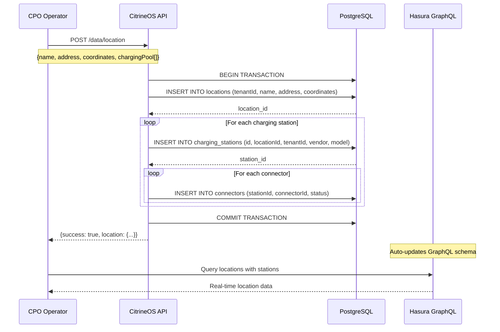
```mermaid
sequenceDiagram
    participant CPO as CPO Operator
    participant API as CitrineOS API
    participant DB as PostgreSQL
    participant Hasura as Hasura GraphQL

    CPO->>API: POST /data/location
    Note over CPO,API: {name, address, coordinates, chargingPool[]}

    API->>DB: BEGIN TRANSACTION
    API->>DB: INSERT INTO locations (tenantId, name, address, coordinates)
    DB-->>API: location_id

    loop For each charging station
        API->>DB: INSERT INTO charging_stations (id, locationId, tenantId, vendor, model)
        DB-->>API: station_id

        loop For each connector
            API->>DB: INSERT INTO connectors (stationId, connectorId, status)
        end
    end

    API->>DB: COMMIT TRANSACTION
    API-->>CPO: {success: true, location: {...}}

    Note over Hasura: Auto-updates GraphQL schema
    CPO->>Hasura: Query locations with stations
    Hasura-->>CPO: Real-time location data
```

### 1.2 Multi-Tenant CPO Management

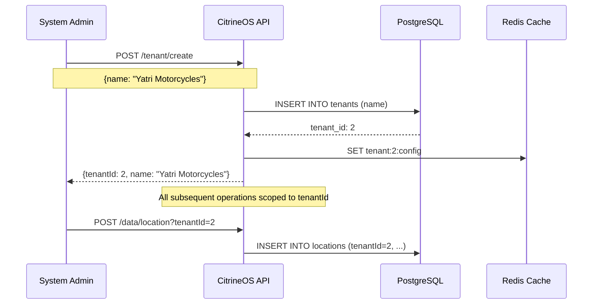
```mermaid
sequenceDiagram
    participant Admin as System Admin
    participant API as CitrineOS API
    participant DB as PostgreSQL
    participant Cache as Redis Cache

    Admin->>API: POST /tenant/create
    Note over Admin,API: {name: "Yatri Motorcycles"}

    API->>DB: INSERT INTO tenants (name)
    DB-->>API: tenant_id: 2

    API->>Cache: SET tenant:2:config
    API-->>Admin: {tenantId: 2, name: "Yatri Motorcycles"}

    Note over API: All subsequent operations scoped to tenantId

    Admin->>API: POST /data/location?tenantId=2
    API->>DB: INSERT INTO locations (tenantId=2, ...)
```

## 2. Charging Station Authentication & Connection

### 2.1 OCPP WebSocket Connection (Security Profile 0-3)

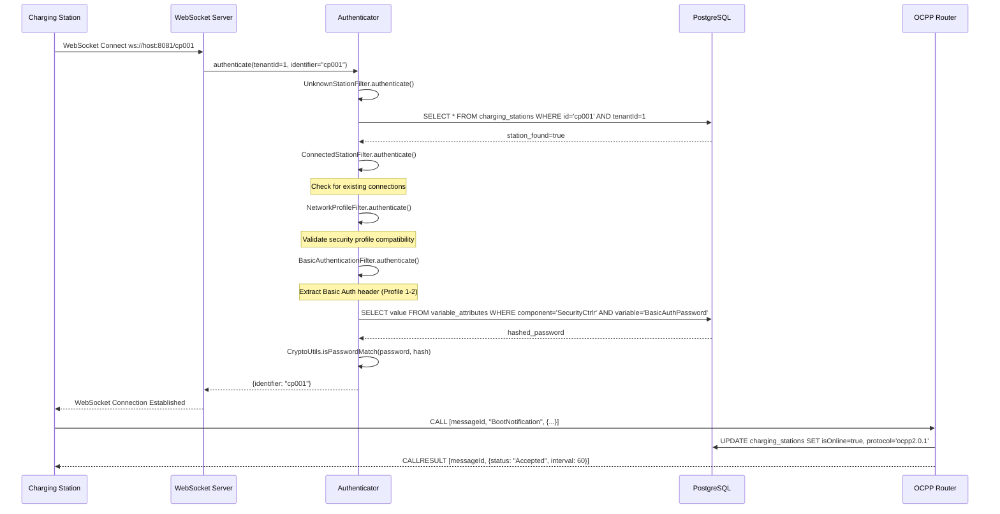
```mermaid
sequenceDiagram
    participant CS as Charging Station
    participant WS as WebSocket Server
    participant Auth as Authenticator
    participant DB as PostgreSQL
    participant OCPP as OCPP Router

    CS->>WS: WebSocket Connect ws://host:8081/cp001
    WS->>Auth: authenticate(tenantId=1, identifier="cp001")

    Auth->>Auth: UnknownStationFilter.authenticate()
    Auth->>DB: SELECT * FROM charging_stations WHERE id='cp001' AND tenantId=1
    DB-->>Auth: station_found=true

    Auth->>Auth: ConnectedStationFilter.authenticate()
    Note over Auth: Check for existing connections

    Auth->>Auth: NetworkProfileFilter.authenticate()
    Note over Auth: Validate security profile compatibility

    Auth->>Auth: BasicAuthenticationFilter.authenticate()
    Note over Auth: Extract Basic Auth header (Profile 1-2)
    Auth->>DB: SELECT value FROM variable_attributes WHERE component='SecurityCtrlr' AND variable='BasicAuthPassword'
    DB-->>Auth: hashed_password
    Auth->>Auth: CryptoUtils.isPasswordMatch(password, hash)

    Auth-->>WS: {identifier: "cp001"}
    WS-->>CS: WebSocket Connection Established

    CS->>OCPP: CALL [messageId, "BootNotification", {...}]
    OCPP->>DB: UPDATE charging_stations SET isOnline=true, protocol='ocpp2.0.1'
    OCPP-->>CS: CALLRESULT [messageId, {status: "Accepted", interval: 60}]
```

### 2.2 Boot Notification Process

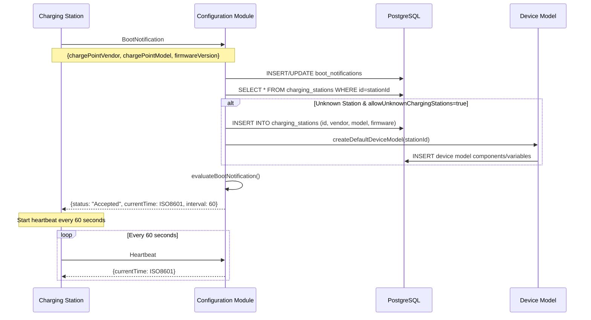
```mermaid
sequenceDiagram
    participant CS as Charging Station
    participant Config as Configuration Module
    participant DB as PostgreSQL
    participant DM as Device Model

    CS->>Config: BootNotification
    Note over CS,Config: {chargePointVendor, chargePointModel, firmwareVersion}

    Config->>DB: INSERT/UPDATE boot_notifications
    Config->>DB: SELECT * FROM charging_stations WHERE id=stationId

    alt Unknown Station & allowUnknownChargingStations=true
        Config->>DB: INSERT INTO charging_stations (id, vendor, model, firmware)
        Config->>DM: createDefaultDeviceModel(stationId)
        DM->>DB: INSERT device model components/variables
    end

    Config->>Config: evaluateBootNotification()
    Config-->>CS: {status: "Accepted", currentTime: ISO8601, interval: 60}

    Note over CS: Start heartbeat every 60 seconds
    loop Every 60 seconds
        CS->>Config: Heartbeat
        Config-->>CS: {currentTime: ISO8601}
    end
```

## 3. EV Driver Authentication

### 3.1 ID Token Authorization Flow

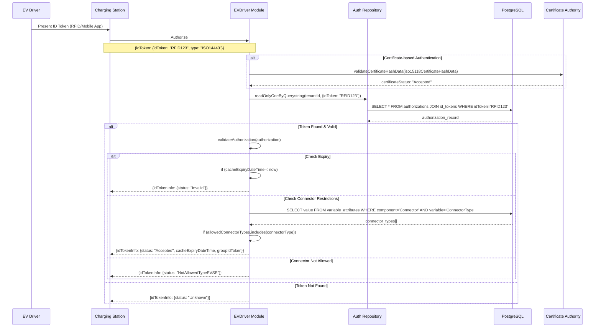
```mermaid
sequenceDiagram
    participant EV as EV Driver
    participant CS as Charging Station
    participant EVD as EVDriver Module
    participant Auth as Auth Repository
    participant DB as PostgreSQL
    participant CA as Certificate Authority

    EV->>CS: Present ID Token (RFID/Mobile App)
    CS->>EVD: Authorize
    Note over CS,EVD: {idToken: {idToken: "RFID123", type: "ISO14443"}}

    alt Certificate-based Authentication
        EVD->>CA: validateCertificateHashData(iso15118CertificateHashData)
        CA-->>EVD: certificateStatus: "Accepted"
    end

    EVD->>Auth: readOnlyOneByQuerystring(tenantId, {idToken: "RFID123"})
    Auth->>DB: SELECT * FROM authorizations JOIN id_tokens WHERE idToken='RFID123'
    DB-->>Auth: authorization_record

    alt Token Found & Valid
        EVD->>EVD: validateAuthorization(authorization)

        alt Check Expiry
            EVD->>EVD: if (cacheExpiryDateTime < now)
            EVD-->>CS: {idTokenInfo: {status: "Invalid"}}
        else Check Connector Restrictions
            EVD->>DB: SELECT value FROM variable_attributes WHERE component='Connector' AND variable='ConnectorType'
            DB-->>EVD: connector_types[]
            EVD->>EVD: if (allowedConnectorTypes.includes(connectorType))
            EVD-->>CS: {idTokenInfo: {status: "Accepted", cacheExpiryDateTime, groupIdToken}}
        else Connector Not Allowed
            EVD-->>CS: {idTokenInfo: {status: "NotAllowedTypeEVSE"}}
        end
    else Token Not Found
        EVD-->>CS: {idTokenInfo: {status: "Unknown"}}
    end
```

### 3.2 Local Authorization List Management

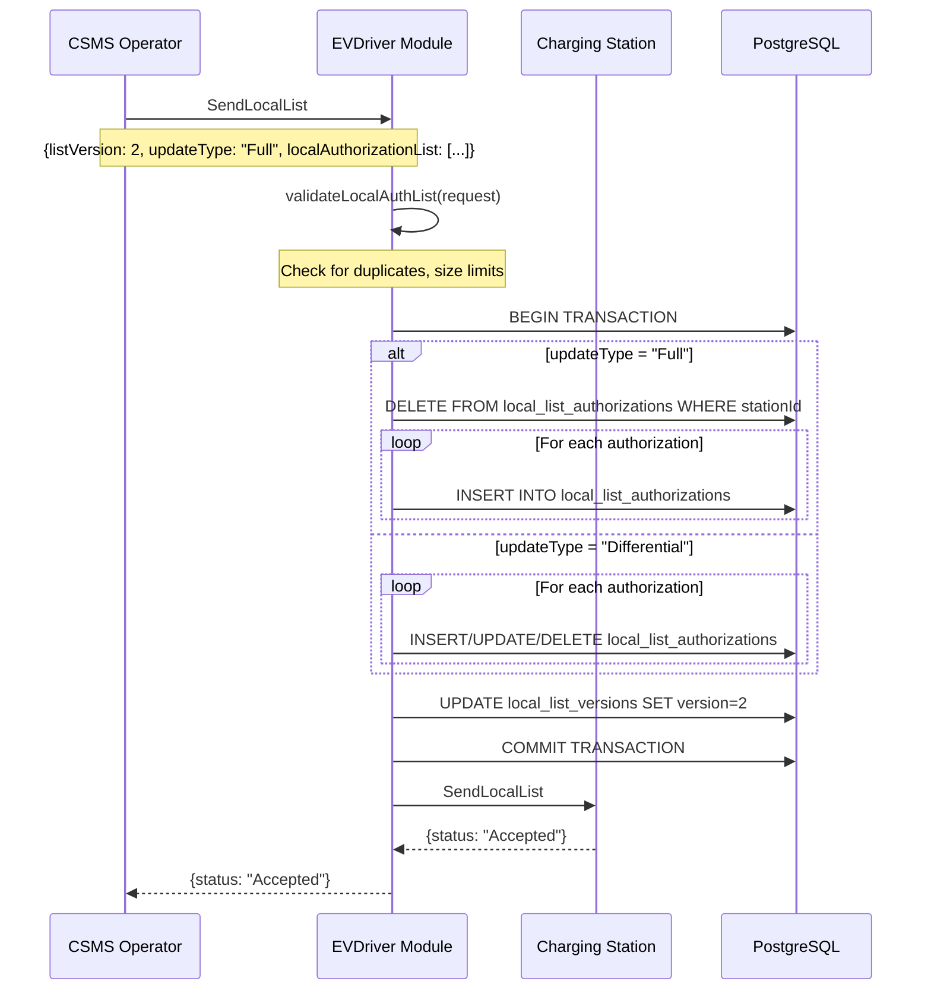
```mermaid
sequenceDiagram
    participant CSMS as CSMS Operator
    participant EVD as EVDriver Module
    participant CS as Charging Station
    participant DB as PostgreSQL

    CSMS->>EVD: SendLocalList
    Note over CSMS,EVD: {listVersion: 2, updateType: "Full", localAuthorizationList: [...]}

    EVD->>EVD: validateLocalAuthList(request)
    Note over EVD: Check for duplicates, size limits

    EVD->>DB: BEGIN TRANSACTION

    alt updateType = "Full"
        EVD->>DB: DELETE FROM local_list_authorizations WHERE stationId
        loop For each authorization
            EVD->>DB: INSERT INTO local_list_authorizations
        end
    else updateType = "Differential"
        loop For each authorization
            EVD->>DB: INSERT/UPDATE/DELETE local_list_authorizations
        end
    end

    EVD->>DB: UPDATE local_list_versions SET version=2
    EVD->>DB: COMMIT TRANSACTION

    EVD->>CS: SendLocalList
    CS-->>EVD: {status: "Accepted"}
    EVD-->>CSMS: {status: "Accepted"}
```

## 4. Charging Transaction Lifecycle

### 4.1 Remote Start Transaction

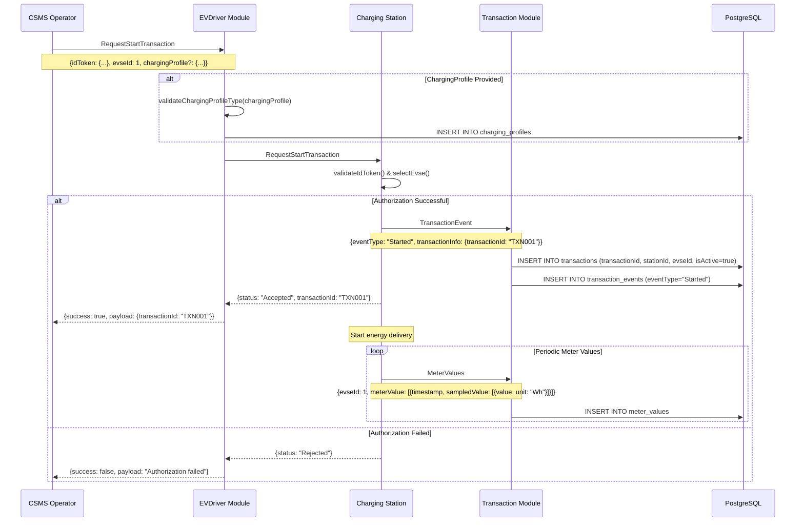
```mermaid
sequenceDiagram
    participant CSMS as CSMS Operator
    participant EVD as EVDriver Module
    participant CS as Charging Station
    participant TXN as Transaction Module
    participant DB as PostgreSQL

    CSMS->>EVD: RequestStartTransaction
    Note over CSMS,EVD: {idToken: {...}, evseId: 1, chargingProfile?: {...}}

    alt ChargingProfile Provided
        EVD->>EVD: validateChargingProfileType(chargingProfile)
        EVD->>DB: INSERT INTO charging_profiles
    end

    EVD->>CS: RequestStartTransaction
    CS->>CS: validateIdToken() & selectEvse()

    alt Authorization Successful
        CS->>TXN: TransactionEvent
        Note over CS,TXN: {eventType: "Started", transactionInfo: {transactionId: "TXN001"}}

        TXN->>DB: INSERT INTO transactions (transactionId, stationId, evseId, isActive=true)
        TXN->>DB: INSERT INTO transaction_events (eventType="Started")

        CS-->>EVD: {status: "Accepted", transactionId: "TXN001"}
        EVD-->>CSMS: {success: true, payload: {transactionId: "TXN001"}}

        Note over CS: Start energy delivery
        loop Periodic Meter Values
            CS->>TXN: MeterValues
            Note over CS,TXN: {evseId: 1, meterValue: [{timestamp, sampledValue: [{value, unit: "Wh"}]}]}
            TXN->>DB: INSERT INTO meter_values
        end
    else Authorization Failed
        CS-->>EVD: {status: "Rejected"}
        EVD-->>CSMS: {success: false, payload: "Authorization failed"}
    end
```

### 4.2 Transaction Event Processing

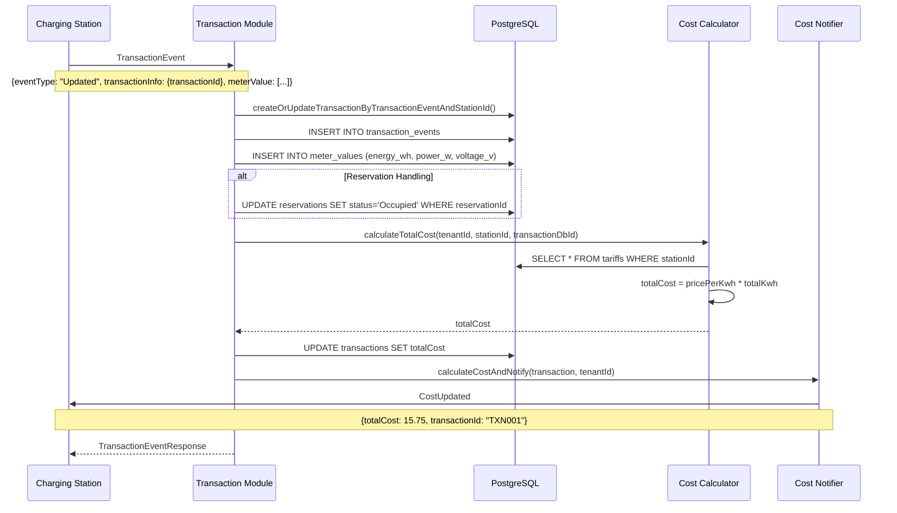
```mermaid
sequenceDiagram
    participant CS as Charging Station
    participant TXN as Transaction Module
    participant DB as PostgreSQL
    participant Cost as Cost Calculator
    participant Notify as Cost Notifier

    CS->>TXN: TransactionEvent
    Note over CS,TXN: {eventType: "Updated", transactionInfo: {transactionId}, meterValue: [...]}

    TXN->>DB: createOrUpdateTransactionByTransactionEventAndStationId()
    TXN->>DB: INSERT INTO transaction_events
    TXN->>DB: INSERT INTO meter_values (energy_wh, power_w, voltage_v)

    alt Reservation Handling
        TXN->>DB: UPDATE reservations SET status='Occupied' WHERE reservationId
    end

    TXN->>Cost: calculateTotalCost(tenantId, stationId, transactionDbId)
    Cost->>DB: SELECT * FROM tariffs WHERE stationId
    Cost->>Cost: totalCost = pricePerKwh * totalKwh
    Cost-->>TXN: totalCost

    TXN->>DB: UPDATE transactions SET totalCost

    TXN->>Notify: calculateCostAndNotify(transaction, tenantId)
    Notify->>CS: CostUpdated
    Note over Notify,CS: {totalCost: 15.75, transactionId: "TXN001"}

    TXN-->>CS: TransactionEventResponse
```

### 4.3 Remote Stop Transaction

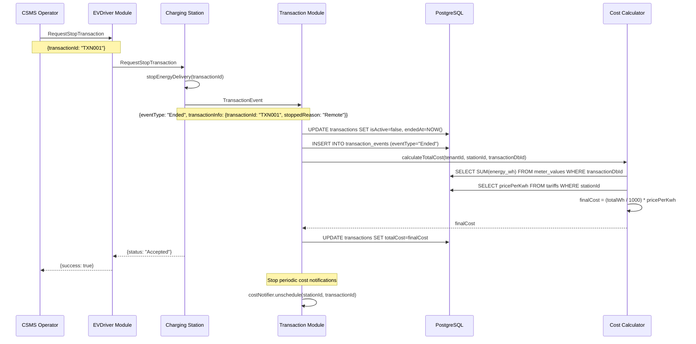
```mermaid
sequenceDiagram
    participant CSMS as CSMS Operator
    participant EVD as EVDriver Module
    participant CS as Charging Station
    participant TXN as Transaction Module
    participant DB as PostgreSQL
    participant Cost as Cost Calculator

    CSMS->>EVD: RequestStopTransaction
    Note over CSMS,EVD: {transactionId: "TXN001"}

    EVD->>CS: RequestStopTransaction
    CS->>CS: stopEnergyDelivery(transactionId)

    CS->>TXN: TransactionEvent
    Note over CS,TXN: {eventType: "Ended", transactionInfo: {transactionId: "TXN001", stoppedReason: "Remote"}}

    TXN->>DB: UPDATE transactions SET isActive=false, endedAt=NOW()
    TXN->>DB: INSERT INTO transaction_events (eventType="Ended")

    TXN->>Cost: calculateTotalCost(tenantId, stationId, transactionDbId)
    Cost->>DB: SELECT SUM(energy_wh) FROM meter_values WHERE transactionDbId
    Cost->>DB: SELECT pricePerKwh FROM tariffs WHERE stationId
    Cost->>Cost: finalCost = (totalWh / 1000) * pricePerKwh
    Cost-->>TXN: finalCost

    TXN->>DB: UPDATE transactions SET totalCost=finalCost

    CS-->>EVD: {status: "Accepted"}
    EVD-->>CSMS: {success: true}

    Note over TXN: Stop periodic cost notifications
    TXN->>TXN: costNotifier.unschedule(stationId, transactionId)
```

## 5. Billing & Cost Management

### 5.1 Tariff Configuration

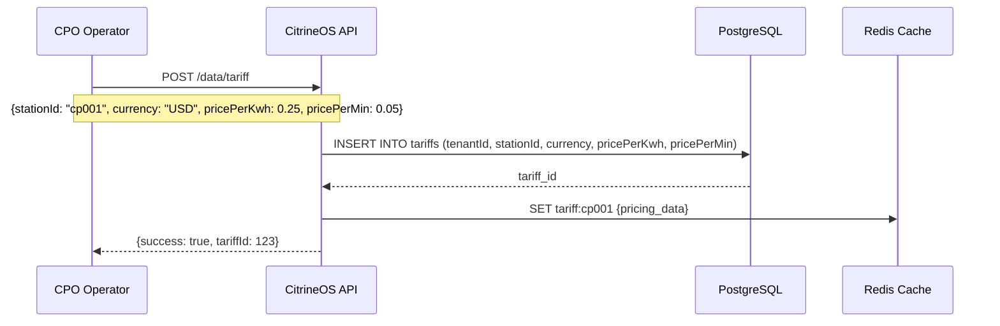
```mermaid
sequenceDiagram
    participant CPO as CPO Operator
    participant API as CitrineOS API
    participant DB as PostgreSQL
    participant Cache as Redis Cache

    CPO->>API: POST /data/tariff
    Note over CPO,API: {stationId: "cp001", currency: "USD", pricePerKwh: 0.25, pricePerMin: 0.05}

    API->>DB: INSERT INTO tariffs (tenantId, stationId, currency, pricePerKwh, pricePerMin)
    DB-->>API: tariff_id

    API->>Cache: SET tariff:cp001 {pricing_data}
    API-->>CPO: {success: true, tariffId: 123}
```

### 5.2 Real-time Cost Updates

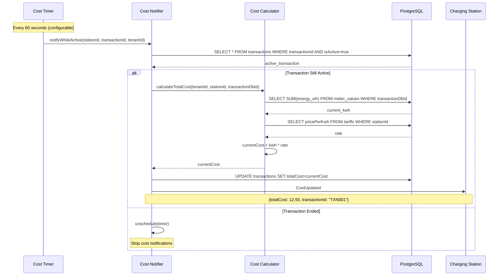
```mermaid
sequenceDiagram
    participant Timer as Cost Timer
    participant Notify as Cost Notifier
    participant Cost as Cost Calculator
    participant DB as PostgreSQL
    participant CS as Charging Station

    Note over Timer: Every 60 seconds (configurable)
    Timer->>Notify: notifyWhileActive(stationId, transactionId, tenantId)

    Notify->>DB: SELECT * FROM transactions WHERE transactionId AND isActive=true
    DB-->>Notify: active_transaction

    alt Transaction Still Active
        Notify->>Cost: calculateTotalCost(tenantId, stationId, transactionDbId)
        Cost->>DB: SELECT SUM(energy_wh) FROM meter_values WHERE transactionDbId
        DB-->>Cost: current_kwh
        Cost->>DB: SELECT pricePerKwh FROM tariffs WHERE stationId
        DB-->>Cost: rate
        Cost->>Cost: currentCost = kwh * rate
        Cost-->>Notify: currentCost

        Notify->>DB: UPDATE transactions SET totalCost=currentCost
        Notify->>CS: CostUpdated
        Note over Notify,CS: {totalCost: 12.50, transactionId: "TXN001"}
    else Transaction Ended
        Notify->>Notify: unschedule(timer)
        Note over Notify: Stop cost notifications
    end
```

## 6. Device Model & Monitoring

### 6.1 Device Model Configuration (OCPP 2.0.1)

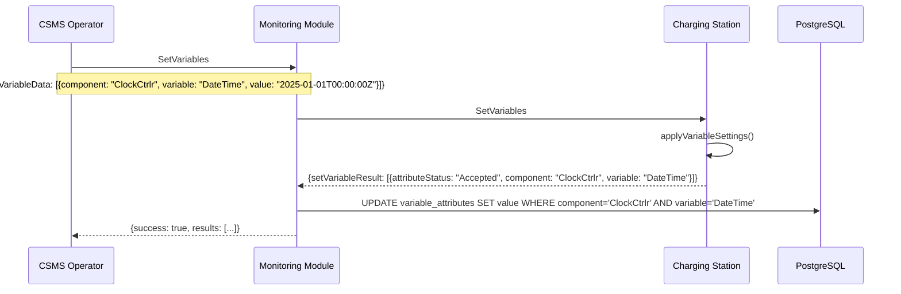
```mermaid
sequenceDiagram
    participant CSMS as CSMS Operator
    participant MON as Monitoring Module
    participant CS as Charging Station
    participant DB as PostgreSQL

    CSMS->>MON: SetVariables
    Note over CSMS,MON: {setVariableData: [{component: "ClockCtrlr", variable: "DateTime", value: "2025-01-01T00:00:00Z"}]}

    MON->>CS: SetVariables
    CS->>CS: applyVariableSettings()
    CS-->>MON: {setVariableResult: [{attributeStatus: "Accepted", component: "ClockCtrlr", variable: "DateTime"}]}

    MON->>DB: UPDATE variable_attributes SET value WHERE component='ClockCtrlr' AND variable='DateTime'
    MON-->>CSMS: {success: true, results: [...]}
```

### 6.2 Variable Monitoring

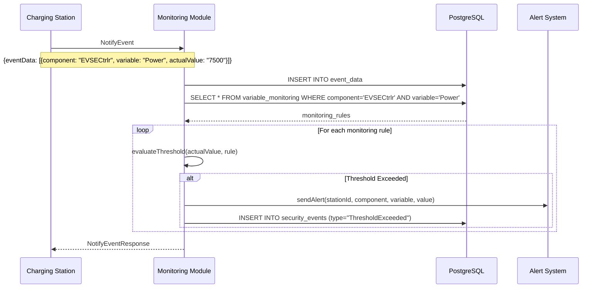
```mermaid
sequenceDiagram
    participant CS as Charging Station
    participant MON as Monitoring Module
    participant DB as PostgreSQL
    participant Alert as Alert System

    CS->>MON: NotifyEvent
    Note over CS,MON: {eventData: [{component: "EVSECtrlr", variable: "Power", actualValue: "7500"}]}

    MON->>DB: INSERT INTO event_data
    MON->>DB: SELECT * FROM variable_monitoring WHERE component='EVSECtrlr' AND variable='Power'
    DB-->>MON: monitoring_rules

    loop For each monitoring rule
        MON->>MON: evaluateThreshold(actualValue, rule)
        alt Threshold Exceeded
            MON->>Alert: sendAlert(stationId, component, variable, value)
            MON->>DB: INSERT INTO security_events (type="ThresholdExceeded")
        end
    end

    MON-->>CS: NotifyEventResponse
```

## 7. Status & Availability Management

### 7.1 Status Notification Processing

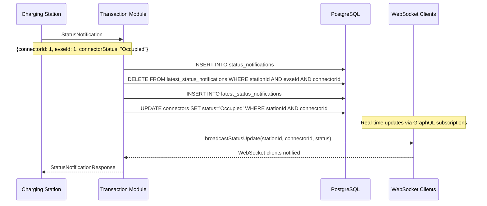
```mermaid
sequenceDiagram
    participant CS as Charging Station
    participant TXN as Transaction Module
    participant DB as PostgreSQL
    participant WS as WebSocket Clients

    CS->>TXN: StatusNotification
    Note over CS,TXN: {connectorId: 1, evseId: 1, connectorStatus: "Occupied"}

    TXN->>DB: INSERT INTO status_notifications
    TXN->>DB: DELETE FROM latest_status_notifications WHERE stationId AND evseId AND connectorId
    TXN->>DB: INSERT INTO latest_status_notifications

    TXN->>DB: UPDATE connectors SET status='Occupied' WHERE stationId AND connectorId

    Note over WS: Real-time updates via GraphQL subscriptions
    TXN->>WS: broadcastStatusUpdate(stationId, connectorId, status)
    WS-->>TXN: WebSocket clients notified

    TXN-->>CS: StatusNotificationResponse
```

### 7.2 Availability Management

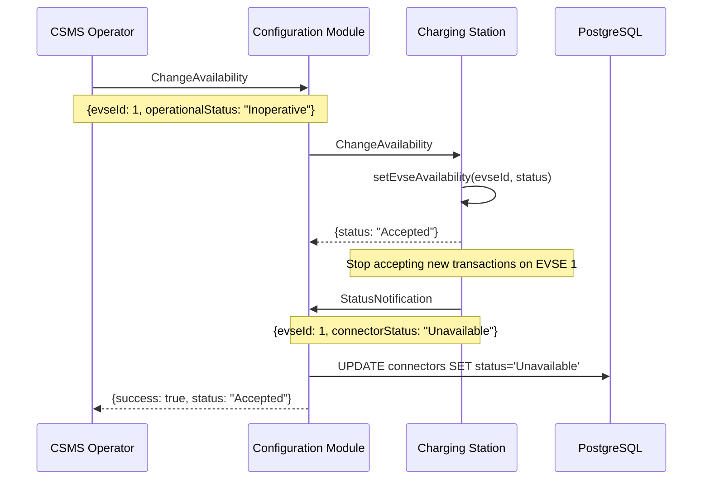
```mermaid
sequenceDiagram
    participant CSMS as CSMS Operator
    participant CFG as Configuration Module
    participant CS as Charging Station
    participant DB as PostgreSQL

    CSMS->>CFG: ChangeAvailability
    Note over CSMS,CFG: {evseId: 1, operationalStatus: "Inoperative"}

    CFG->>CS: ChangeAvailability
    CS->>CS: setEvseAvailability(evseId, status)
    CS-->>CFG: {status: "Accepted"}

    Note over CS: Stop accepting new transactions on EVSE 1
    CS->>CFG: StatusNotification
    Note over CS,CFG: {evseId: 1, connectorStatus: "Unavailable"}

    CFG->>DB: UPDATE connectors SET status='Unavailable'
    CFG-->>CSMS: {success: true, status: "Accepted"}
```

## 8. Complete CSMS Operation Flow

### 8.1 End-to-End Charging Session

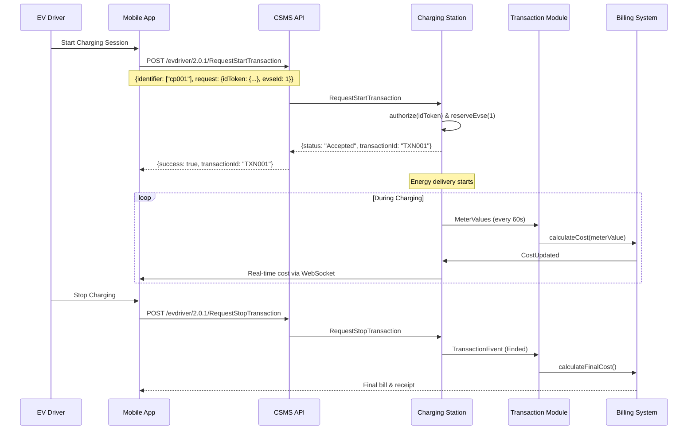
```mermaid
sequenceDiagram
    participant EV as EV Driver
    participant Mobile as Mobile App
    participant CSMS as CSMS API
    participant CS as Charging Station
    participant TXN as Transaction Module
    participant Bill as Billing System

    EV->>Mobile: Start Charging Session
    Mobile->>CSMS: POST /evdriver/2.0.1/RequestStartTransaction
    Note over Mobile,CSMS: {identifier: ["cp001"], request: {idToken: {...}, evseId: 1}}

    CSMS->>CS: RequestStartTransaction
    CS->>CS: authorize(idToken) & reserveEvse(1)
    CS-->>CSMS: {status: "Accepted", transactionId: "TXN001"}
    CSMS-->>Mobile: {success: true, transactionId: "TXN001"}

    Note over CS: Energy delivery starts
    loop During Charging
        CS->>TXN: MeterValues (every 60s)
        TXN->>Bill: calculateCost(meterValue)
        Bill->>CS: CostUpdated
        CS->>Mobile: Real-time cost via WebSocket
    end

    EV->>Mobile: Stop Charging
    Mobile->>CSMS: POST /evdriver/2.0.1/RequestStopTransaction
    CSMS->>CS: RequestStopTransaction
    CS->>TXN: TransactionEvent (Ended)
    TXN->>Bill: calculateFinalCost()
    Bill-->>Mobile: Final bill & receipt
```

---

# 🔥 **OCPP 2.0.1 Real Hardware Integration Sequences**

_Detailed sequences from August 25, 2025 real IoCharger AC station integration_

## A. Infrastructure Management Sequences (OCPP 2.0.1)

### A.1 Yatri Motorcycles Tenant Creation via Hasura GraphQL

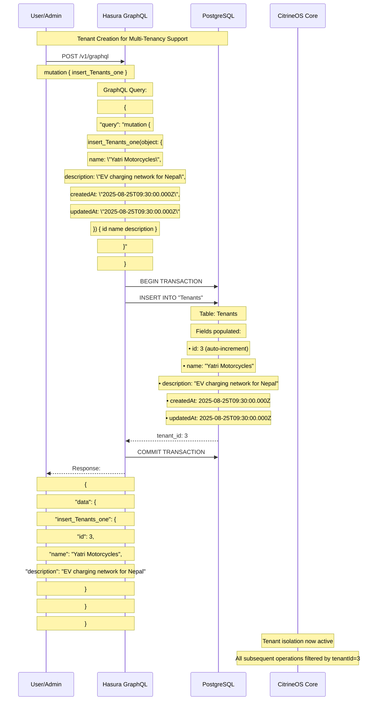
```mermaid
sequenceDiagram
    participant User as User/Admin
    participant Hasura as Hasura GraphQL
    participant DB as PostgreSQL
    participant CitrineOS as CitrineOS Core

    Note over User,DB: Tenant Creation for Multi-Tenancy Support

    User->>Hasura: POST /v1/graphql
    Note over User,Hasura: mutation { insert_Tenants_one }

    Note over Hasura: GraphQL Query:
    Note over Hasura: {
    Note over Hasura:   "query": "mutation {
    Note over Hasura:     insert_Tenants_one(object: {
    Note over Hasura:       name: \"Yatri Motorcycles\",
    Note over Hasura:       description: \"EV charging network for Nepal\",
    Note over Hasura:       createdAt: \"2025-08-25T09:30:00.000Z\",
    Note over Hasura:       updatedAt: \"2025-08-25T09:30:00.000Z\"
    Note over Hasura:     }) { id name description }
    Note over Hasura:   }"
    Note over Hasura: }

    Hasura->>DB: BEGIN TRANSACTION
    Hasura->>DB: INSERT INTO "Tenants"
    Note over DB: Table: Tenants
    Note over DB: Fields populated:
    Note over DB: • id: 3 (auto-increment)
    Note over DB: • name: "Yatri Motorcycles"
    Note over DB: • description: "EV charging network for Nepal"
    Note over DB: • createdAt: 2025-08-25T09:30:00.000Z
    Note over DB: • updatedAt: 2025-08-25T09:30:00.000Z

    DB-->>Hasura: tenant_id: 3
    Hasura->>DB: COMMIT TRANSACTION

    Hasura-->>User: Response:
    Note over User,Hasura: {
    Note over User,Hasura:   "data": {
    Note over User,Hasura:     "insert_Tenants_one": {
    Note over User,Hasura:       "id": 3,
    Note over User,Hasura:       "name": "Yatri Motorcycles",
    Note over User,Hasura:       "description": "EV charging network for Nepal"
    Note over User,Hasura:     }
    Note over User,Hasura:   }
    Note over User,Hasura: }

    Note over CitrineOS: Tenant isolation now active
    Note over CitrineOS: All subsequent operations filtered by tenantId=3
```

### A.2 Yatri Kathmandu Charging Hub Location Creation

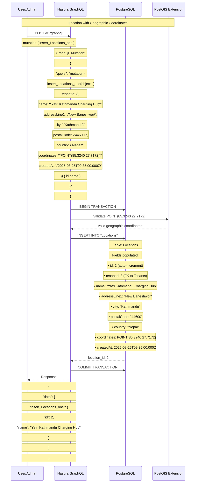
```mermaid
sequenceDiagram
    participant User as User/Admin
    participant Hasura as Hasura GraphQL
    participant DB as PostgreSQL
    participant PostGIS as PostGIS Extension

    Note over User,PostGIS: Location with Geographic Coordinates

    User->>Hasura: POST /v1/graphql
    Note over User,Hasura: mutation { insert_Locations_one }

    Note over Hasura: GraphQL Mutation:
    Note over Hasura: {
    Note over Hasura:   "query": "mutation {
    Note over Hasura:     insert_Locations_one(object: {
    Note over Hasura:       tenantId: 3,
    Note over Hasura:       name: \"Yatri Kathmandu Charging Hub\",
    Note over Hasura:       addressLine1: \"New Baneshwor\",
    Note over Hasura:       city: \"Kathmandu\",
    Note over Hasura:       postalCode: \"44600\",
    Note over Hasura:       country: \"Nepal\",
    Note over Hasura:       coordinates: \"POINT(85.3240 27.7172)\",
    Note over Hasura:       createdAt: \"2025-08-25T09:35:00.000Z\"
    Note over Hasura:     }) { id name }
    Note over Hasura:   }"
    Note over Hasura: }

    Hasura->>DB: BEGIN TRANSACTION
    Hasura->>PostGIS: Validate POINT(85.3240 27.7172)
    PostGIS-->>Hasura: Valid geographic coordinates

    Hasura->>DB: INSERT INTO "Locations"
    Note over DB: Table: Locations
    Note over DB: Fields populated:
    Note over DB: • id: 2 (auto-increment)
    Note over DB: • tenantId: 3 (FK to Tenants)
    Note over DB: • name: "Yatri Kathmandu Charging Hub"
    Note over DB: • addressLine1: "New Baneshwor"
    Note over DB: • city: "Kathmandu"
    Note over DB: • postalCode: "44600"
    Note over DB: • country: "Nepal"
    Note over DB: • coordinates: POINT(85.3240 27.7172)
    Note over DB: • createdAt: 2025-08-25T09:35:00.000Z

    DB-->>Hasura: location_id: 2
    Hasura->>DB: COMMIT TRANSACTION

    Hasura-->>User: Response:
    Note over User,Hasura: {
    Note over User,Hasura:   "data": {
    Note over User,Hasura:     "insert_Locations_one": {
    Note over User,Hasura:       "id": 2,
    Note over User,Hasura:       "name": "Yatri Kathmandu Charging Hub"
    Note over User,Hasura:     }
    Note over User,Hasura:   }
    Note over User,Hasura: }
```

### A.3 Real IoCharger AC Station Registration (OCPP 2.0.1)

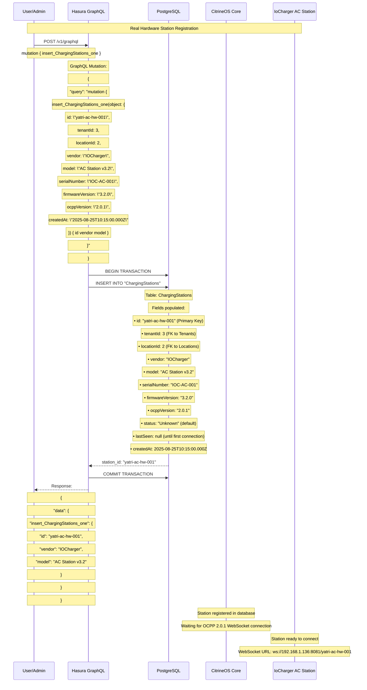
```mermaid
sequenceDiagram
    participant User as User/Admin
    participant Hasura as Hasura GraphQL
    participant DB as PostgreSQL
    participant CitrineOS as CitrineOS Core
    participant IoCharger as IoCharger AC Station

    Note over User,IoCharger: Real Hardware Station Registration

    User->>Hasura: POST /v1/graphql
    Note over User,Hasura: mutation { insert_ChargingStations_one }

    Note over Hasura: GraphQL Mutation:
    Note over Hasura: {
    Note over Hasura:   "query": "mutation {
    Note over Hasura:     insert_ChargingStations_one(object: {
    Note over Hasura:       id: \"yatri-ac-hw-001\",
    Note over Hasura:       tenantId: 3,
    Note over Hasura:       locationId: 2,
    Note over Hasura:       vendor: \"IOCharger\",
    Note over Hasura:       model: \"AC Station v3.2\",
    Note over Hasura:       serialNumber: \"IOC-AC-001\",
    Note over Hasura:       firmwareVersion: \"3.2.0\",
    Note over Hasura:       ocppVersion: \"2.0.1\",
    Note over Hasura:       createdAt: \"2025-08-25T10:15:00.000Z\"
    Note over Hasura:     }) { id vendor model }
    Note over Hasura:   }"
    Note over Hasura: }

    Hasura->>DB: BEGIN TRANSACTION
    Hasura->>DB: INSERT INTO "ChargingStations"
    Note over DB: Table: ChargingStations
    Note over DB: Fields populated:
    Note over DB: • id: "yatri-ac-hw-001" (Primary Key)
    Note over DB: • tenantId: 3 (FK to Tenants)
    Note over DB: • locationId: 2 (FK to Locations)
    Note over DB: • vendor: "IOCharger"
    Note over DB: • model: "AC Station v3.2"
    Note over DB: • serialNumber: "IOC-AC-001"
    Note over DB: • firmwareVersion: "3.2.0"
    Note over DB: • ocppVersion: "2.0.1"
    Note over DB: • status: "Unknown" (default)
    Note over DB: • lastSeen: null (until first connection)
    Note over DB: • createdAt: 2025-08-25T10:15:00.000Z

    DB-->>Hasura: station_id: "yatri-ac-hw-001"
    Hasura->>DB: COMMIT TRANSACTION

    Hasura-->>User: Response:
    Note over User,Hasura: {
    Note over User,Hasura:   "data": {
    Note over User,Hasura:     "insert_ChargingStations_one": {
    Note over User,Hasura:       "id": "yatri-ac-hw-001",
    Note over User,Hasura:       "vendor": "IOCharger",
    Note over User,Hasura:       "model": "AC Station v3.2"
    Note over User,Hasura:     }
    Note over User,Hasura:   }
    Note over User,Hasura: }

    Note over CitrineOS: Station registered in database
    Note over CitrineOS: Waiting for OCPP 2.0.1 WebSocket connection
    Note over IoCharger: Station ready to connect
    Note over IoCharger: WebSocket URL: ws://192.168.1.136:8081/yatri-ac-hw-001
```

## B. Authorization System Sequences (OCPP 2.0.1)

### B.1 Pre-Configured Authorization Tokens Setup


```mermaid
sequenceDiagram
    participant User as User/Admin
    participant Hasura as Hasura GraphQL
    participant DB as PostgreSQL
    participant CitrineOS as CitrineOS Auth

    Note over User,CitrineOS: 3-Table Authorization Model Implementation

    rect rgb(240, 240, 255)
        Note over User,DB: Step 1: Create RFID IdToken
        User->>Hasura: POST /v1/graphql (IdTokens)

        Note over Hasura: GraphQL Mutation:
        Note over Hasura: {
        Note over Hasura:   "query": "mutation {
        Note over Hasura:     insert_IdTokens_one(object: {
        Note over Hasura:       idToken: \"YATRI-WALK-001234\",
        Note over Hasura:       type: \"ISO14443\",
        Note over Hasura:       tenantId: 3,
        Note over Hasura:       createdAt: \"2025-08-25T10:20:00.000Z\"
        Note over Hasura:     }) { id idToken type }
        Note over Hasura:   }"
        Note over Hasura: }

        Hasura->>DB: INSERT INTO "IdTokens"
        Note over DB: Table: IdTokens
        Note over DB: Fields populated:
        Note over DB: • id: 3 (auto-increment)
        Note over DB: • idToken: "YATRI-WALK-001234"
        Note over DB: • type: "ISO14443"
        Note over DB: • tenantId: 3 (isolation)
        Note over DB: • createdAt: 2025-08-25T10:20:00.000Z

        DB-->>Hasura: token_id: 3
        Hasura-->>User: {"data": {"insert_IdTokens_one": {"id": 3}}}
    end

    rect rgb(255, 240, 240)
        Note over User,DB: Step 2: Create IdTokenInfo (Authorization Metadata)
        User->>Hasura: POST /v1/graphql (IdTokenInfos)

        Note over Hasura: GraphQL Mutation:
        Note over Hasura: {
        Note over Hasura:   "query": "mutation {
        Note over Hasura:     insert_IdTokenInfos_one(object: {
        Note over Hasura:       status: \"Accepted\",
        Note over Hasura:       chargingPriority: 5,
        Note over Hasura:       language1: \"ne\",
        Note over Hasura:       language2: \"en\",
        Note over Hasura:       cacheExpiryDateTime: \"2025-12-31T23:59:59.000Z\",
        Note over Hasura:       createdAt: \"2025-08-25T10:21:00.000Z\"
        Note over Hasura:     }) { id status }
        Note over Hasura:   }"
        Note over Hasura: }

        Hasura->>DB: INSERT INTO "IdTokenInfos"
        Note over DB: Table: IdTokenInfos
        Note over DB: Fields populated:
        Note over DB: • id: 2 (auto-increment)
        Note over DB: • status: "Accepted"
        Note over DB: • chargingPriority: 5 (walk-in customer)
        Note over DB: • language1: "ne" (Nepali primary)
        Note over DB: • language2: "en" (English secondary)
        Note over DB: • cacheExpiryDateTime: 2025-12-31T23:59:59.000Z
        Note over DB: • createdAt: 2025-08-25T10:21:00.000Z

        DB-->>Hasura: info_id: 2
        Hasura-->>User: {"data": {"insert_IdTokenInfos_one": {"id": 2}}}
    end

    rect rgb(240, 255, 240)
        Note over User,DB: Step 3: Create Authorization Link
        User->>Hasura: POST /v1/graphql (Authorizations)

        Note over Hasura: GraphQL Mutation:
        Note over Hasura: {
        Note over Hasura:   "query": "mutation {
        Note over Hasura:     insert_Authorizations_one(object: {
        Note over Hasura:       idTokenId: 3,
        Note over Hasura:       idTokenInfoId: 2,
        Note over Hasura:       concurrentTransaction: false,
        Note over Hasura:       createdAt: \"2025-08-25T10:22:00.000Z\"
        Note over Hasura:     }) { id idTokenId idTokenInfoId }
        Note over Hasura:   }"
        Note over Hasura: }

        Hasura->>DB: INSERT INTO "Authorizations"
        Note over DB: Table: Authorizations
        Note over DB: Fields populated:
        Note over DB: • id: 3 (auto-increment)
        Note over DB: • idTokenId: 3 (FK to IdTokens)
        Note over DB: • idTokenInfoId: 2 (FK to IdTokenInfos)
        Note over DB: • concurrentTransaction: false
        Note over DB: • createdAt: 2025-08-25T10:22:00.000Z

        DB-->>Hasura: auth_id: 3
        Hasura-->>User: {"data": {"insert_Authorizations_one": {"id": 3}}}
    end

    Note over CitrineOS: Authorization chain complete:
    Note over CitrineOS: IdTokens(3) → Authorizations(3) → IdTokenInfos(2)
    Note over CitrineOS: Token "YATRI-WALK-001234" now authorized with status "Accepted"
```

### B.2 Mobile App Token Creation (KeyCode Type)

```mermaid
sequenceDiagram
    participant User as User/Admin
    participant Hasura as Hasura GraphQL
    participant DB as PostgreSQL

    Note over User,DB: Mobile App Authorization Token Setup

    rect rgb(255, 255, 240)
        Note over User,DB: Mobile App Token (KeyCode Type)

        User->>Hasura: POST /v1/graphql (IdTokens)
        Note over Hasura: Mobile App Token Creation:
        Note over Hasura: {
        Note over Hasura:   idToken: "YATRI-APP-5678",
        Note over Hasura:   type: "KeyCode",
        Note over Hasura:   tenantId: 3
        Note over Hasura: }

        Hasura->>DB: INSERT INTO "IdTokens"
        Note over DB: • id: 4
        Note over DB: • idToken: "YATRI-APP-5678"
        Note over DB: • type: "KeyCode" (not ISO14443)
        Note over DB: • tenantId: 3

        User->>Hasura: POST /v1/graphql (IdTokenInfos)
        Note over Hasura: Higher Priority for Mobile Users:
        Note over Hasura: {
        Note over Hasura:   status: "Accepted",
        Note over Hasura:   chargingPriority: 3,
        Note over Hasura:   language1: "en",
        Note over Hasura:   language2: "ne"
        Note over Hasura: }

        Hasura->>DB: INSERT INTO "IdTokenInfos"
        Note over DB: • id: 3
        Note over DB: • chargingPriority: 3 (higher than walk-in)
        Note over DB: • status: "Accepted"

        User->>Hasura: POST /v1/graphql (Authorizations)
        Hasura->>DB: INSERT INTO "Authorizations"
        Note over DB: • id: 4
        Note over DB: • idTokenId: 4 (mobile token)
        Note over DB: • idTokenInfoId: 3 (higher priority info)
        Note over DB: • concurrentTransaction: true (mobile allows concurrent)
    end

    Note over DB: Two authorization tokens ready:
    Note over DB: 1. YATRI-WALK-001234 (RFID, Priority 5)
    Note over DB: 2. YATRI-APP-5678 (Mobile, Priority 3)
```

### B.3 Physical RFID Card Discovery and Integration

```mermaid
sequenceDiagram
    participant User as Physical User
    participant IoCharger as IoCharger AC Station
    participant CitrineOS as CitrineOS EVDriver
    participant DB as PostgreSQL
    participant Admin as System Admin
    participant Hasura as Hasura GraphQL

    Note over User,Hasura: Physical RFID Discovery Process

    rect rgb(255, 240, 240)
        Note over User,CitrineOS: Phase 1: Unknown RFID Discovery

        User->>IoCharger: Tap RFID Card (D6A3FA03)
        IoCharger->>CitrineOS: OCPP 2.0.1 Authorize Request

        Note over IoCharger,CitrineOS: WebSocket Message:
        Note over IoCharger,CitrineOS: [2, "auth-uuid", "Authorize", {
        Note over IoCharger,CitrineOS:   "idToken": {
        Note over IoCharger,CitrineOS:     "idToken": "D6A3FA03",
        Note over IoCharger,CitrineOS:     "type": "ISO14443"
        Note over IoCharger,CitrineOS:   }
        Note over IoCharger,CitrineOS: }]

        CitrineOS->>DB: SELECT FROM IdTokens WHERE idToken='D6A3FA03'
        DB-->>CitrineOS: No results found

        CitrineOS->>IoCharger: OCPP 2.0.1 Authorize Response
        Note over IoCharger,CitrineOS: WebSocket Response:
        Note over IoCharger,CitrineOS: [3, "auth-uuid", {
        Note over IoCharger,CitrineOS:   "idTokenInfo": {
        Note over IoCharger,CitrineOS:     "status": "Unknown"
        Note over IoCharger,CitrineOS:   }
        Note over IoCharger,CitrineOS: }]

        IoCharger-->>User: Access Denied (Unknown Token)

        Note over CitrineOS: Log Entry Created:
        Note over CitrineOS: Message {
        Note over CitrineOS:   _action: 'Authorize',
        Note over CitrineOS:   _payload: { idTokenInfo: { status: 'Unknown' } },
        Note over CitrineOS:   idToken: 'D6A3FA03'
        Note over CitrineOS: }
    end

    rect rgb(240, 255, 240)
        Note over Admin,DB: Phase 2: RFID Token Registration

        Admin->>CitrineOS: Check logs for unknown tokens
        Note over Admin: docker logs server-citrine-1 | grep "idToken.*D6A3FA03"

        Admin->>Hasura: POST /v1/graphql (Create IdToken)
        Note over Hasura: Token Registration:
        Note over Hasura: {
        Note over Hasura:   "query": "mutation {
        Note over Hasura:     insert_IdTokens_one(object: {
        Note over Hasura:       idToken: \"D6A3FA03\",
        Note over Hasura:       type: \"ISO14443\",
        Note over Hasura:       tenantId: 1,
        Note over Hasura:       createdAt: \"2025-08-25T11:20:00.000Z\"
        Note over Hasura:     }) { id }
        Note over Hasura:   }"
        Note over Hasura: }

        Hasura->>DB: INSERT INTO "IdTokens"
        Note over DB: Table: IdTokens
        Note over DB: • id: 5 (new entry)
        Note over DB: • idToken: "D6A3FA03"
        Note over DB: • type: "ISO14443"
        Note over DB: • tenantId: 1

        Admin->>Hasura: POST /v1/graphql (Create IdTokenInfo)
        Hasura->>DB: INSERT INTO "IdTokenInfos"
        Note over DB: • id: 4
        Note over DB: • status: "Accepted"
        Note over DB: • chargingPriority: 3

        Admin->>Hasura: POST /v1/graphql (Create Authorization)
        Hasura->>DB: INSERT INTO "Authorizations"
        Note over DB: • id: 5
        Note over DB: • idTokenId: 5 (D6A3FA03)
        Note over DB: • idTokenInfoId: 4 (Accepted status)
        Note over DB: • concurrentTransaction: true
    end

    rect rgb(240, 240, 255)
        Note over User,DB: Phase 3: Authorized RFID Usage

        User->>IoCharger: Tap RFID Card (D6A3FA03) Again
        IoCharger->>CitrineOS: OCPP 2.0.1 Transaction Start (Optimized)

        Note over IoCharger,CitrineOS: No separate Authorize - Direct TransactionEvent:
        Note over IoCharger,CitrineOS: [2, "tx-uuid", "TransactionEvent", {
        Note over IoCharger,CitrineOS:   "eventType": "Started",
        Note over IoCharger,CitrineOS:   "timestamp": "2025-08-25T11:28:49.000Z",
        Note over IoCharger,CitrineOS:   "triggerReason": "Authorized",
        Note over IoCharger,CitrineOS:   "transactionInfo": {
        Note over IoCharger,CitrineOS:     "transactionId": "2e962b0d-c29d-4225-8b32-54666b1b1b90"
        Note over IoCharger,CitrineOS:   },
        Note over IoCharger,CitrineOS:   "idToken": {
        Note over IoCharger,CitrineOS:     "idToken": "D6A3FA03",
        Note over IoCharger,CitrineOS:     "type": "ISO14443"
        Note over IoCharger,CitrineOS:   },
        Note over IoCharger,CitrineOS:   "evse": { "id": 1, "connectorId": 1 }
        Note over IoCharger,CitrineOS: }]

        CitrineOS->>DB: INSERT INTO "Transactions"
        Note over DB: Table: Transactions
        Note over DB: • transactionId: "2e962b0d-c29d-4225-8b32-54666b1b1b90"
        Note over DB: • stationId: "yatri-ac-hw-001"
        Note over DB: • evseId: 1
        Note over DB: • connectorId: 1
        Note over DB: • idToken: "D6A3FA03"
        Note over DB: • status: "Started"
        Note over DB: • startTime: 2025-08-25T11:28:49.000Z

        CitrineOS->>IoCharger: TransactionEvent Response
        IoCharger-->>User: Charging Started (Ready for EV connection)
    end

    Note over User,DB: RFID Integration Complete:
    Note over User,DB: D6A3FA03 → One-tap charging enabled
```

## C. OCPP 2.0.1 Physical Hardware Connection Sequences

### C.1 IoCharger Network Configuration and Connection Establishment

```mermaid
sequenceDiagram
    participant Admin as Network Admin
    participant IoCharger as IoCharger AC Station
    participant Router as WiFi Router
    participant CSMS as CitrineOS CSMS
    participant DB as PostgreSQL

    Note over Admin,DB: Network Configuration and OCPP Connection Setup

    rect rgb(255, 240, 240)
        Note over Admin,IoCharger: Phase 1: Initial Configuration (Hotspot Mode)

        Admin->>IoCharger: Connect to WiFi: IOC-XXXXXX (IOC12345)
        IoCharger-->>Admin: Connected to hotspot (192.168.10.1)

        Admin->>IoCharger: Access http://192.168.10.1:8900
        IoCharger-->>Admin: Configuration interface (admin/ioc12345)

        Note over Admin,IoCharger: Initial WRONG Configuration:
        Admin->>IoCharger: Configure OCPP Settings
        Note over IoCharger: WRONG: OCPP Server Domain: 192.168.10.158
        Note over IoCharger: WRONG: WiFi Mode: Access Point
        Note over IoCharger: Result: Only works when admin on hotspot

        Admin->>IoCharger: Save and Restart
        IoCharger->>CSMS: WebSocket Connection Attempt
        Note over CSMS: ws://192.168.10.158:8081/yatri-ac-hw-001
        CSMS-->>IoCharger: Connection Established (WRONG topology)
    end

    rect rgb(255, 255, 240)
        Note over Admin,DB: Phase 2: Network Issue Discovery

        Admin->>Router: Disconnect from IoCharger hotspot
        Router-->>Admin: Connected to main WiFi (192.168.1.136)

        Note over CSMS: Connection Lost! Log Entry:
        Note over CSMS: [INFO] Connection closed for 1:yatri-ac-hw-001
        Note over CSMS: [INFO] Queue 1:yatri-ac-hw-001 deleted

        Admin->>CSMS: Check connection status
        CSMS-->>Admin: No connection found for yatri-ac-hw-001

        Note over Admin: Issue Identified: Network Dependency
        Note over Admin: Charger only works when admin on its hotspot!
    end

    rect rgb(240, 255, 240)
        Note over Admin,DB: Phase 3: Correct Network Configuration

        Admin->>IoCharger: Reconnect to hotspot for reconfiguration
        Admin->>IoCharger: Access configuration interface

        Note over Admin,IoCharger: Network Settings Configuration:
        Admin->>IoCharger: Configure WiFi Client Mode
        Note over IoCharger: WiFi Mode: Client (NOT Access Point)
        Note over IoCharger: WiFi SSID: [Main WiFi Network]
        Note over IoCharger: WiFi Password: [Main WiFi Password]
        Note over IoCharger: DHCP: Enabled

        Note over Admin,IoCharger: OCPP Settings Correction:
        Admin->>Router: Find main WiFi IP
        Note over Router: ifconfig | grep inet: 192.168.1.136

        Admin->>IoCharger: Update OCPP Server Domain
        Note over IoCharger: CORRECT: OCPP Server Domain: 192.168.1.136
        Note over IoCharger: CORRECT: Network Mode: WiFi Client

        Admin->>IoCharger: Save All Settings and Restart
    end

    rect rgb(240, 240, 255)
        Note over Router,DB: Phase 4: Proper OCPP 2.0.1 Connection

        IoCharger->>Router: Connect to main WiFi as client
        Router-->>IoCharger: IP assigned via DHCP

        IoCharger->>CSMS: WebSocket Connection (Correct topology)
        Note over IoCharger,CSMS: ws://192.168.1.136:8081/yatri-ac-hw-001

        Note over CSMS: OCPP 2.0.1 Connection Handshake:
        CSMS->>IoCharger: WebSocket Accept

        IoCharger->>CSMS: OCPP 2.0.1 BootNotification
        Note over IoCharger,CSMS: [2, "boot-uuid", "BootNotification", {
        Note over IoCharger,CSMS:   "chargingStation": {
        Note over IoCharger,CSMS:     "model": "AC Station v3.2",
        Note over IoCharger,CSMS:     "vendorName": "IOCharger",
        Note over IoCharger,CSMS:     "firmwareVersion": "3.2.0",
        Note over IoCharger,CSMS:     "serialNumber": "IOC-AC-001"
        Note over IoCharger,CSMS:   },
        Note over IoCharger,CSMS:   "reason": "PowerUp"
        Note over IoCharger,CSMS: }]

        CSMS->>DB: UPDATE ChargingStations SET status='Available'
        Note over DB: UPDATE "ChargingStations"
        Note over DB: WHERE id='yatri-ac-hw-001'
        Note over DB: SET status='Available',
        Note over DB:     lastSeen='2025-08-25T10:57:54.000Z',
        Note over DB:     firmwareVersion='3.2.0'

        CSMS->>IoCharger: BootNotification Response
        Note over IoCharger,CSMS: [3, "boot-uuid", {
        Note over IoCharger,CSMS:   "status": "Accepted",
        Note over IoCharger,CSMS:   "currentTime": "2025-08-25T10:57:54.500Z",
        Note over IoCharger,CSMS:   "interval": 60
        Note over IoCharger,CSMS: }]

        IoCharger->>CSMS: StatusNotification (Connector Available)
        Note over IoCharger,CSMS: [2, "status-uuid", "StatusNotification", {
        Note over IoCharger,CSMS:   "timestamp": "2025-08-25T10:57:00Z",
        Note over IoCharger,CSMS:   "connectorStatus": "Available",
        Note over IoCharger,CSMS:   "evseId": 1,
        Note over IoCharger,CSMS:   "connectorId": 1
        Note over IoCharger,CSMS: }]

        CSMS->>DB: UPDATE Connectors SET status='Available'

        Note over CSMS,DB: Heartbeat Configuration Applied:
        IoCharger->>CSMS: Heartbeat (every 60 seconds)
        CSMS->>IoCharger: Heartbeat Response (current time)

        Note over CSMS,IoCharger: WebSocket Ping/Pong (every 30 seconds)
        CSMS->>IoCharger: WebSocket Ping
        IoCharger->>CSMS: WebSocket Pong
    end

    Admin->>Router: Disconnect from IoCharger hotspot
    Router-->>Admin: Back to main WiFi

    Note over CSMS: Connection MAINTAINED!
    Note over CSMS: Regular heartbeats continue
    Note over CSMS: Network independence achieved

    Note over Admin,DB: Success: Proper Network Topology
    Note over Admin,DB: CSMS ←→ WiFi Router ←→ IoCharger (Client)
    Note over Admin,DB: No hotspot dependency
```

### C.2 OCPP 2.0.1 Advanced Communication Settings Configuration

```mermaid
sequenceDiagram
    participant Admin as System Admin
    participant IoCharger as IoCharger Web Interface
    participant OCPP as OCPP Communication Controller
    participant CSMS as CitrineOS CSMS

    Note over Admin,CSMS: Advanced OCPP 2.0.1 Parameter Configuration

    rect rgb(255, 240, 240)
        Note over Admin,OCPP: Phase 1: Initial Problem - No Heartbeats

        Admin->>IoCharger: Access http://192.168.10.1:8900/ocpp.html
        IoCharger-->>Admin: OCPP Configuration Page

        Note over Admin,IoCharger: INITIAL PROBLEMATIC SETTINGS:
        Note over IoCharger: OCPPCommCtrlr Enabled: False
        Note over IoCharger: HeartbeatInterval: 0  ⚠️ CRITICAL ISSUE
        Note over IoCharger: WebSocketPingInterval: undefined
        Note over IoCharger: QueueAllMessages: False

        Note over CSMS: Result: No heartbeats received
        Note over CSMS: Connection unstable and drops frequently
    end

    rect rgb(240, 255, 240)
        Note over Admin,CSMS: Phase 2: Corrected OCPP 2.0.1 Settings

        Admin->>IoCharger: Update OCPP Communication Settings

        Note over IoCharger: CORRECTED SETTINGS:
        Note over IoCharger: OCPPCommCtrlr Enabled: True ✅
        Note over IoCharger: HeartbeatInterval: 60 ✅
        Note over IoCharger: NetworkConfigurationPriority: 1
        Note over IoCharger: NetworkProfileConnectionAttempts: 3
        Note over IoCharger: OfflineThreshold: 120
        Note over IoCharger: QueueAllMessages: True ✅
        Note over IoCharger: MessageAttempts: 3
        Note over IoCharger: MessageAttemptInterval: 10
        Note over IoCharger: UnlockOnEVSideDisconnect: True
        Note over IoCharger: ResetRetries: 3
        Note over IoCharger: WebSocketPingInterval: 30 ✅
        Note over IoCharger: RetryBackOffRepeatTimes: 3
        Note over IoCharger: RetryBackOffRandomRange: 0
        Note over IoCharger: RetryBackOffWaitMinimum: 10

        Admin->>IoCharger: Save Settings
        Admin->>IoCharger: Restart Charging Station
    end

    rect rgb(240, 240, 255)
        Note over OCPP,CSMS: Phase 3: Proper OCPP 2.0.1 Communication

        IoCharger->>CSMS: Reconnect with proper settings

        loop Every 60 seconds
            IoCharger->>CSMS: OCPP 2.0.1 Heartbeat
            Note over IoCharger,CSMS: [2, "hb-uuid", "Heartbeat", {}]

            CSMS->>IoCharger: Heartbeat Response
            Note over IoCharger,CSMS: [3, "hb-uuid", {
            Note over IoCharger,CSMS:   "currentTime": "2025-08-25T10:54:52.728Z"
            Note over IoCharger,CSMS: }]
        end

        loop Every 30 seconds
            CSMS->>IoCharger: WebSocket Ping
            Note over CSMS: Pinging client 1:yatri-ac-hw-001

            IoCharger->>CSMS: WebSocket Pong
            Note over CSMS: Pong received for 1:yatri-ac-hw-001
        end

        Note over CSMS: Connection Stability Achieved:
        Note over CSMS: • Regular heartbeats every 60s
        Note over CSMS: • WebSocket health checks every 30s
        Note over CSMS: • Message queuing enabled
        Note over CSMS: • Retry mechanisms configured
        Note over CSMS: • No disconnections during rapid API calls
    end

    Note over Admin,CSMS: Result: Production-Ready OCPP 2.0.1 Communication
    Note over Admin,CSMS: Stable connection suitable for real EV charging
```

## D. Transaction Management Sequences (OCPP 2.0.1)

### D.1 Remote API Transaction Start via CitrineOS REST API

```mermaid
sequenceDiagram
    participant API as API Client
    participant CSMS as CitrineOS CSMS
    participant EVDriver as EVDriverModule
    participant DB as PostgreSQL
    participant IoCharger as IoCharger AC Station
    participant TXN as TransactionsModule

    Note over API,TXN: Remote Transaction Start via OCPP 2.0.1 API

    rect rgb(240, 255, 240)
        Note over API,EVDriver: Phase 1: API Request Processing

        API->>CSMS: POST /ocpp/2.0.1/evdriver/requestStartTransaction
        Note over API,CSMS: Query Parameters:
        Note over API,CSMS: ?tenantId=1&identifier=yatri-ac-hw-001

        Note over API,CSMS: Request Body:
        Note over API,CSMS: {
        Note over API,CSMS:   "remoteStartId": 10,
        Note over API,CSMS:   "idToken": {
        Note over API,CSMS:     "idToken": "D6A3FA03",
        Note over API,CSMS:     "type": "ISO14443"
        Note over API,CSMS:   },
        Note over API,CSMS:   "evseId": 1
        Note over API,CSMS: }

        CSMS->>EVDriver: Route to EVDriverModule.requestStartTransaction()

        EVDriver->>DB: SELECT authorization for D6A3FA03
        Note over DB: Query: SELECT a.*, iti.status
        Note over DB: FROM "Authorizations" a
        Note over DB: JOIN "IdTokens" it ON a.idTokenId = it.id
        Note over DB: JOIN "IdTokenInfos" iti ON a.idTokenInfoId = iti.id
        Note over DB: WHERE it.idToken = 'D6A3FA03'
        Note over DB: AND it.tenantId = 1

        DB-->>EVDriver: Authorization found: status="Accepted"

        EVDriver->>IoCharger: OCPP 2.0.1 RequestStartTransaction
    end

    rect rgb(255, 255, 240)
        Note over IoCharger,TXN: Phase 2: OCPP 2.0.1 Message Exchange

        Note over EVDriver,IoCharger: WebSocket Message:
        Note over EVDriver,IoCharger: [2, "req-start-uuid", "RequestStartTransaction", {
        Note over EVDriver,IoCharger:   "remoteStartId": 10,
        Note over EVDriver,IoCharger:   "idToken": {
        Note over EVDriver,IoCharger:     "idToken": "D6A3FA03",
        Note over EVDriver,IoCharger:     "type": "ISO14443"
        Note over EVDriver,IoCharger:   },
        Note over EVDriver,IoCharger:   "evseId": 1
        Note over EVDriver,IoCharger: }]

        IoCharger->>EVDriver: RequestStartTransaction Response
        Note over EVDriver,IoCharger: [3, "req-start-uuid", {
        Note over EVDriver,IoCharger:   "status": "Accepted"
        Note over EVDriver,IoCharger: }]

        EVDriver-->>API: HTTP Response
        Note over API,EVDriver: [{"success": true}]

        Note over IoCharger: Charger prepares for transaction
        Note over IoCharger: EVSE 1 Connector 1 ready for EV connection
    end

    rect rgb(240, 240, 255)
        Note over IoCharger,DB: Phase 3: Transaction Event (When EV Connects)

        Note over IoCharger: EV cable connected (simulated)

        IoCharger->>TXN: OCPP 2.0.1 TransactionEvent (Started)
        Note over IoCharger,TXN: [2, "tx-start-uuid", "TransactionEvent", {
        Note over IoCharger,TXN:   "seqNo": 0,
        Note over IoCharger,TXN:   "eventType": "Started",
        Note over IoCharger,TXN:   "timestamp": "2025-08-25T12:45:30.000Z",
        Note over IoCharger,TXN:   "triggerReason": "RemoteStart",
        Note over IoCharger,TXN:   "transactionInfo": {
        Note over IoCharger,TXN:     "transactionId": "api-tx-uuid-001",
        Note over IoCharger,TXN:     "remoteStartId": 10
        Note over IoCharger,TXN:   },
        Note over IoCharger,TXN:   "idToken": {
        Note over IoCharger,TXN:     "idToken": "D6A3FA03",
        Note over IoCharger,TXN:     "type": "ISO14443"
        Note over IoCharger,TXN:   },
        Note over IoCharger,TXN:   "evse": { "id": 1, "connectorId": 1 },
        Note over IoCharger,TXN:   "meterValue": [{
        Note over IoCharger,TXN:     "timestamp": "2025-08-25T12:45:30.000Z",
        Note over IoCharger,TXN:     "sampledValue": [{
        Note over IoCharger,TXN:       "value": 2000,
        Note over IoCharger,TXN:       "context": "Transaction.Begin",
        Note over IoCharger,TXN:       "measurand": "Energy.Active.Import.Register",
        Note over IoCharger,TXN:       "unitOfMeasure": { "unit": "Wh", "multiplier": 0 }
        Note over IoCharger,TXN:     }]
        Note over IoCharger,TXN:   }],
        Note over IoCharger,TXN:   "offline": false
        Note over IoCharger,TXN: }]

        TXN->>DB: INSERT INTO "Transactions"
        Note over DB: Table: Transactions
        Note over DB: Fields populated:
        Note over DB: • transactionId: "api-tx-uuid-001"
        Note over DB: • stationId: "yatri-ac-hw-001"
        Note over DB: • tenantId: 1 (inherited)
        Note over DB: • evseId: 1
        Note over DB: • connectorId: 1
        Note over DB: • idToken: "D6A3FA03"
        Note over DB: • remoteStartId: 10
        Note over DB: • status: "Started"
        Note over DB: • startTime: 2025-08-25T12:45:30.000Z
        Note over DB: • startMeterValue: 2000 (Wh)
        Note over DB: • triggerReason: "RemoteStart"

        TXN->>IoCharger: TransactionEvent Response
        Note over IoCharger,TXN: [3, "tx-start-uuid", {
        Note over IoCharger,TXN:   "totalCost": 0
        Note over IoCharger,TXN: }]
    end

    Note over API,DB: Remote Transaction Started Successfully
    Note over API,DB: Ready for charging with real-time monitoring
```

### D.2 Physical RFID Tap-to-Charge Transaction (Optimized Flow)

```mermaid
sequenceDiagram
    participant User as Physical User
    participant IoCharger as IoCharger AC Station
    participant TXN as TransactionsModule
    participant DB as PostgreSQL
    participant Billing as BillingModule

    Note over User,Billing: Physical RFID One-Tap Transaction (OCPP 2.0.1)

    rect rgb(255, 240, 255)
        Note over User,TXN: Phase 1: Optimized Authorization (No Separate Authorize)

        User->>IoCharger: Tap RFID Card (D6A3FA03)

        Note over IoCharger: Internal RFID Recognition:
        Note over IoCharger: • Token: D6A3FA03 detected
        Note over IoCharger: • Type: ISO14443
        Note over IoCharger: • Pre-authorized in cache
        Note over IoCharger: • Skip separate Authorize message

        IoCharger->>TXN: OCPP 2.0.1 TransactionEvent (Direct Start)
        Note over IoCharger,TXN: [2, "rfid-tx-uuid", "TransactionEvent", {
        Note over IoCharger,TXN:   "seqNo": 0,
        Note over IoCharger,TXN:   "eventType": "Started",
        Note over IoCharger,TXN:   "timestamp": "2025-08-25T11:28:49.000Z",
        Note over IoCharger,TXN:   "triggerReason": "Authorized",
        Note over IoCharger,TXN:   "transactionInfo": {
        Note over IoCharger,TXN:     "transactionId": "2e962b0d-c29d-4225-8b32-54666b1b1b90"
        Note over IoCharger,TXN:   },
        Note over IoCharger,TXN:   "idToken": {
        Note over IoCharger,TXN:     "idToken": "D6A3FA03",
        Note over IoCharger,TXN:     "type": "ISO14443"
        Note over IoCharger,TXN:   },
        Note over IoCharger,TXN:   "evse": { "id": 1, "connectorId": 1 },
        Note over IoCharger,TXN:   "meterValue": [{
        Note over IoCharger,TXN:     "timestamp": "2025-08-25T11:28:49.000Z",
        Note over IoCharger,TXN:     "sampledValue": [{
        Note over IoCharger,TXN:       "value": 2000,
        Note over IoCharger,TXN:       "context": "Transaction.Begin",
        Note over IoCharger,TXN:       "measurand": "Energy.Active.Import.Register",
        Note over IoCharger,TXN:       "unitOfMeasure": { "unit": "Wh" }
        Note over IoCharger,TXN:     }]
        Note over IoCharger,TXN:   }]
        Note over IoCharger,TXN: }]
    end

    rect rgb(240, 255, 255)
        Note over TXN,Billing: Phase 2: Database Transaction Creation

        TXN->>DB: BEGIN TRANSACTION

        TXN->>DB: INSERT INTO "Transactions"
        Note over DB: Table: Transactions
        Note over DB: Fields populated:
        Note over DB: • transactionId: "2e962b0d-c29d-4225-8b32-54666b1b1b90"
        Note over DB: • stationId: "yatri-ac-hw-001"
        Note over DB: • tenantId: 1
        Note over DB: • evseId: 1
        Note over DB: • connectorId: 1
        Note over DB: • idToken: "D6A3FA03"
        Note over DB: • status: "Started"
        Note over DB: • startTime: 2025-08-25T11:28:49.000Z
        Note over DB: • startMeterValue: 2000
        Note over DB: • triggerReason: "Authorized"
        Note over DB: • offline: false

        TXN->>DB: INSERT INTO "TransactionEvents"
        Note over DB: Table: TransactionEvents
        Note over DB: • id: auto-increment
        Note over DB: • transactionId: "2e962b0d-c29d-4225-8b32-54666b1b1b90"
        Note over DB: • seqNo: 0
        Note over DB: • eventType: "Started"
        Note over DB: • timestamp: 2025-08-25T11:28:49.000Z
        Note over DB: • triggerReason: "Authorized"

        TXN->>DB: INSERT INTO "MeterValues"
        Note over DB: Table: MeterValues
        Note over DB: • transactionId: "2e962b0d-c29d-4225-8b32-54666b1b1b90"
        Note over DB: • timestamp: 2025-08-25T11:28:49.000Z
        Note over DB: • value: 2000
        Note over DB: • context: "Transaction.Begin"
        Note over DB: • measurand: "Energy.Active.Import.Register"
        Note over DB: • unit: "Wh"

        TXN->>Billing: initializeTransaction()
        Billing->>DB: INSERT INTO "BillingRecords"
        Note over DB: Table: BillingRecords
        Note over DB: • transactionId: "2e962b0d-c29d-4225-8b32-54666b1b1b90"
        Note over DB: • idToken: "D6A3FA03"
        Note over DB: • startTime: 2025-08-25T11:28:49.000Z
        Note over DB: • energyRate: 15.00 (NPR/kWh)
        Note over DB: • timeRate: 1.00 (NPR/min)
        Note over DB: • sessionFee: 25.00 (NPR)
        Note over DB: • currency: "NPR"
        Note over DB: • status: "Active"

        TXN->>DB: COMMIT TRANSACTION

        TXN->>IoCharger: TransactionEvent Response
        Note over IoCharger,TXN: [3, "rfid-tx-uuid", { "totalCost": 0 }]

        IoCharger-->>User: Transaction Started (LED/Display feedback)
    end

    rect rgb(255, 255, 240)
        Note over User,DB: Phase 3: Periodic Meter Value Updates

        loop Every 60 seconds (while charging)
            IoCharger->>TXN: TransactionEvent (Updated)
            Note over IoCharger,TXN: [2, "update-uuid", "TransactionEvent", {
            Note over IoCharger,TXN:   "seqNo": 1, 2, 3... (incrementing)
            Note over IoCharger,TXN:   "eventType": "Updated",
            Note over IoCharger,TXN:   "triggerReason": "MeterValuePeriodic",
            Note over IoCharger,TXN:   "transactionInfo": {
            Note over IoCharger,TXN:     "transactionId": "2e962b0d-c29d-4225-8b32-54666b1b1b90",
            Note over IoCharger,TXN:     "timeSpentCharging": 60 (seconds)
            Note over IoCharger,TXN:   },
            Note over IoCharger,TXN:   "meterValue": [{
            Note over IoCharger,TXN:     "timestamp": "current-time",
            Note over IoCharger,TXN:     "sampledValue": [{
            Note over IoCharger,TXN:       "value": 2000 + energy_consumed,
            Note over IoCharger,TXN:       "measurand": "Energy.Active.Import.Register"
            Note over IoCharger,TXN:     }]
            Note over IoCharger,TXN:   }]
            Note over IoCharger,TXN: }]

            TXN->>DB: INSERT INTO "MeterValues"
            TXN->>Billing: updateTransactionCost()
            Billing->>DB: UPDATE "BillingRecords"
            Note over DB: • currentEnergy: updated value
            Note over DB: • currentCost: recalculated
            Note over DB: • chargingTime: updated duration
        end
    end

    rect rgb(240, 240, 255)
        Note over User,DB: Phase 4: Transaction End (EVConnectTimeout)

        Note over IoCharger: No EV connected - Timeout after 60 seconds

        IoCharger->>TXN: TransactionEvent (Ended)
        Note over IoCharger,TXN: [2, "end-uuid", "TransactionEvent", {
        Note over IoCharger,TXN:   "seqNo": 5,
        Note over IoCharger,TXN:   "eventType": "Ended",
        Note over IoCharger,TXN:   "timestamp": "2025-08-25T11:29:50.000Z",
        Note over IoCharger,TXN:   "triggerReason": "EVConnectTimeout",
        Note over IoCharger,TXN:   "transactionInfo": {
        Note over IoCharger,TXN:     "transactionId": "2e962b0d-c29d-4225-8b32-54666b1b1b90",
        Note over IoCharger,TXN:     "stoppedReason": "Timeout"
        Note over IoCharger,TXN:   }
        Note over IoCharger,TXN: }]

        TXN->>DB: UPDATE "Transactions"
        Note over DB: SET status = 'Ended',
        Note over DB:     endTime = '2025-08-25T11:29:50.000Z',
        Note over DB:     stoppedReason = 'Timeout'

        TXN->>Billing: finalizeTransaction()
        Billing->>DB: UPDATE "BillingRecords"
        Note over DB: • endTime: 2025-08-25T11:29:50.000Z
        Note over DB: • totalEnergy: 0 (no charging occurred)
        Note over DB: • totalTime: 61 seconds
        Note over DB: • totalCost: 0.00 (no energy consumed)
        Note over DB: • status: "Completed"

        TXN->>IoCharger: TransactionEvent Response
        Note over IoCharger,TXN: [3, "end-uuid", { "totalCost": 0 }]

        IoCharger-->>User: Transaction Ended (LED/Display feedback)
    end

    Note over User,DB: RFID Tap-to-Charge Complete
    Note over User,DB: One-tap transaction with no separate authorization
    Note over User,DB: Ready for real EV charging
```

### D.3 Transaction Stop via Remote API

```mermaid
sequenceDiagram
    participant API as API Client
    participant CSMS as CitrineOS CSMS
    participant EVDriver as EVDriverModule
    participant IoCharger as IoCharger AC Station
    participant TXN as TransactionsModule
    participant DB as PostgreSQL
    participant Billing as BillingModule

    Note over API,Billing: Remote Transaction Stop via OCPP 2.0.1 API

    rect rgb(255, 240, 240)
        Note over API,EVDriver: Phase 1: API Stop Request

        API->>CSMS: POST /ocpp/2.0.1/evdriver/requestStopTransaction
        Note over API,CSMS: Query: ?tenantId=1&identifier=yatri-ac-hw-001
        Note over API,CSMS: Body: { "transactionId": "api-tx-uuid-001" }

        CSMS->>EVDriver: Route to EVDriverModule.requestStopTransaction()

        EVDriver->>DB: SELECT transaction details
        Note over DB: SELECT * FROM "Transactions"
        Note over DB: WHERE transactionId = 'api-tx-uuid-001'
        Note over DB: AND stationId = 'yatri-ac-hw-001'
        Note over DB: AND tenantId = 1
        Note over DB: AND status = 'Started'

        DB-->>EVDriver: Transaction found and active

        EVDriver->>IoCharger: OCPP 2.0.1 RequestStopTransaction
    end

    rect rgb(240, 255, 240)
        Note over EVDriver,IoCharger: Phase 2: OCPP Stop Command

        Note over EVDriver,IoCharger: WebSocket Message:
        Note over EVDriver,IoCharger: [2, "req-stop-uuid", "RequestStopTransaction", {
        Note over EVDriver,IoCharger:   "transactionId": "api-tx-uuid-001"
        Note over EVDriver,IoCharger: }]

        IoCharger->>EVDriver: RequestStopTransaction Response
        Note over EVDriver,IoCharger: [3, "req-stop-uuid", {
        Note over EVDriver,IoCharger:   "status": "Accepted"
        Note over EVDriver,IoCharger: }]

        EVDriver-->>API: HTTP Response
        Note over API,EVDriver: [{"success": true}]

        Note over IoCharger: Charger initiates stop sequence
        Note over IoCharger: Stops energy delivery
        Note over IoCharger: Prepares final meter reading
    end

    rect rgb(240, 240, 255)
        Note over IoCharger,Billing: Phase 3: Final Transaction Event

        IoCharger->>TXN: OCPP 2.0.1 TransactionEvent (Ended)
        Note over IoCharger,TXN: [2, "final-tx-uuid", "TransactionEvent", {
        Note over IoCharger,TXN:   "seqNo": 10,
        Note over IoCharger,TXN:   "eventType": "Ended",
        Note over IoCharger,TXN:   "timestamp": "2025-08-25T13:15:45.000Z",
        Note over IoCharger,TXN:   "triggerReason": "RemoteStop",
        Note over IoCharger,TXN:   "transactionInfo": {
        Note over IoCharger,TXN:     "transactionId": "api-tx-uuid-001",
        Note over IoCharger,TXN:     "stoppedReason": "Remote"
        Note over IoCharger,TXN:   },
        Note over IoCharger,TXN:   "meterValue": [{
        Note over IoCharger,TXN:     "timestamp": "2025-08-25T13:15:45.000Z",
        Note over IoCharger,TXN:     "sampledValue": [{
        Note over IoCharger,TXN:       "value": 12500,
        Note over IoCharger,TXN:       "context": "Transaction.End",
        Note over IoCharger,TXN:       "measurand": "Energy.Active.Import.Register",
        Note over IoCharger,TXN:       "unitOfMeasure": { "unit": "Wh" }
        Note over IoCharger,TXN:     }]
        Note over IoCharger,TXN:   }]
        Note over IoCharger,TXN: }]

        TXN->>DB: BEGIN TRANSACTION

        TXN->>DB: UPDATE "Transactions"
        Note over DB: SET status = 'Ended',
        Note over DB:     endTime = '2025-08-25T13:15:45.000Z',
        Note over DB:     endMeterValue = 12500,
        Note over DB:     energyConsumed = 10.5, -- (12500-2000)/1000
        Note over DB:     stoppedReason = 'Remote',
        Note over DB:     chargingTime = 1816 -- seconds

        TXN->>DB: INSERT INTO "TransactionEvents"
        Note over DB: • eventType: "Ended"
        Note over DB: • seqNo: 10
        Note over DB: • triggerReason: "RemoteStop"

        TXN->>DB: INSERT INTO "MeterValues" (final reading)
        Note over DB: • value: 12500
        Note over DB: • context: "Transaction.End"

        TXN->>Billing: calculateFinalCost()

        Note over Billing: Cost Calculation:
        Note over Billing: Energy Cost: 10.5 kWh × NPR 15.00 = NPR 157.50
        Note over Billing: Time Cost: 30.27 min × NPR 1.00 = NPR 30.27
        Note over Billing: Session Fee: NPR 25.00
        Note over Billing: Subtotal: NPR 212.77
        Note over Billing: Tax (13%): NPR 27.66
        Note over Billing: Total: NPR 240.43

        Billing->>DB: UPDATE "BillingRecords"
        Note over DB: • endTime: 2025-08-25T13:15:45.000Z
        Note over DB: • totalEnergy: 10.5
        Note over DB: • totalTime: 1816
        Note over DB: • energyCost: 157.50
        Note over DB: • timeCost: 30.27
        Note over DB: • sessionFee: 25.00
        Note over DB: • subtotal: 212.77
        Note over DB: • tax: 27.66
        Note over DB: • totalCost: 240.43
        Note over DB: • currency: "NPR"
        Note over DB: • status: "Finalized"

        TXN->>DB: COMMIT TRANSACTION

        TXN->>IoCharger: TransactionEvent Response
        Note over IoCharger,TXN: [3, "final-tx-uuid", {
        Note over IoCharger,TXN:   "totalCost": 240.43
        Note over IoCharger,TXN: }]
    end

    Note over API,Billing: Remote Stop Complete
    Note over API,Billing: Final bill: NPR 240.43
    Note over API,Billing: Transaction properly closed
```

## E. Tariff and Billing Sequences (OCPP 2.0.1)

### E.1 Tariff Configuration for Yatri Motorcycles

```mermaid
sequenceDiagram
    participant Admin as Admin/CPO
    participant Hasura as Hasura GraphQL
    participant DB as PostgreSQL
    participant Billing as BillingModule
    participant Money as Money Class

    Note over Admin,Money: Yatri Motorcycles Tariff Configuration (NPR)

    rect rgb(240, 255, 240)
        Note over Admin,Billing: Phase 1: Base Tariff Creation

        Admin->>Hasura: POST /v1/graphql
        Note over Admin,Hasura: mutation { insert_Tariffs_one }

        Note over Hasura: GraphQL Mutation:
        Note over Hasura: {
        Note over Hasura:   "query": "mutation {
        Note over Hasura:     insert_Tariffs_one(object: {
        Note over Hasura:       tenantId: 1,
        Note over Hasura:       name: \"Yatri Standard AC Charging\",
        Note over Hasura:       description: \"Standard rates for AC charging\",
        Note over Hasura:       currency: \"NPR\",
        Note over Hasura:       priceLevel: 1,
        Note over Hasura:       validFrom: \"2025-08-25T00:00:00.000Z\",
        Note over Hasura:       validTo: \"2025-12-31T23:59:59.000Z\",
        Note over Hasura:       createdAt: \"2025-08-25T09:40:00.000Z\"
        Note over Hasura:     }) { id name currency }
        Note over Hasura:   }"
        Note over Hasura: }

        Hasura->>DB: INSERT INTO "Tariffs"
        Note over DB: Table: Tariffs
        Note over DB: Fields populated:
        Note over DB: • id: 1 (auto-increment)
        Note over DB: • tenantId: 1 (Yatri Motorcycles)
        Note over DB: • name: "Yatri Standard AC Charging"
        Note over DB: • description: "Standard rates for AC charging"
        Note over DB: • currency: "NPR"
        Note over DB: • priceLevel: 1
        Note over DB: • validFrom: 2025-08-25T00:00:00.000Z
        Note over DB: • validTo: 2025-12-31T23:59:59.000Z
        Note over DB: • status: "Active"

        DB-->>Hasura: tariff_id: 1
        Hasura-->>Admin: {"data": {"insert_Tariffs_one": {"id": 1}}}
    end

    rect rgb(255, 255, 240)
        Note over Admin,Money: Phase 2: Energy Rate Configuration

        Admin->>Hasura: POST /v1/graphql (TariffElements)
        Note over Hasura: Energy Component:
        Note over Hasura: {
        Note over Hasura:   tariffId: 1,
        Note over Hasura:   priceComponent: "ENERGY",
        Note over Hasura:   price: 1500, // NPR 15.00 in minor units
        Note over Hasura:   stepSize: 1000, // per kWh (1000 Wh)
        Note over Hasura:   unit: "KWH",
        Note over Hasura:   minAmount: 0,
        Note over Hasura:   maxAmount: 1000000 // 1000 kWh max
        Note over Hasura: }

        Hasura->>DB: INSERT INTO "TariffElements"
        Note over DB: Table: TariffElements
        Note over DB: • id: 1
        Note over DB: • tariffId: 1 (FK to Tariffs)
        Note over DB: • priceComponent: "ENERGY"
        Note over DB: • price: 1500 (minor units: NPR 15.00)
        Note over DB: • stepSize: 1000 (per 1000 Wh = 1 kWh)
        Note over DB: • unit: "KWH"
        Note over DB: • minAmount: 0
        Note over DB: • maxAmount: 1000000

        Admin->>Money: Validate price precision
        Money->>Money: new Money(1500, 'NPR')
        Note over Money: Validation:
        Note over Money: • amount: 1500 (minor units)
        Note over Money: • currency: NPR
        Note over Money: • decimal places: 2
        Note over Money: • display: "NPR 15.00"
        Money-->>Admin: Price validated and formatted
    end

    rect rgb(255, 240, 255)
        Note over Admin,DB: Phase 3: Time-Based Rate Configuration

        Admin->>Hasura: POST /v1/graphql (Time Component)
        Note over Hasura: Time Component:
        Note over Hasura: {
        Note over Hasura:   tariffId: 1,
        Note over Hasura:   priceComponent: "TIME",
        Note over Hasura:   price: 100, // NPR 1.00 per minute
        Note over Hasura:   stepSize: 60, // per minute (60 seconds)
        Note over Hasura:   unit: "MINUTE"
        Note over Hasura: }

        Hasura->>DB: INSERT INTO "TariffElements"
        Note over DB: • id: 2
        Note over DB: • priceComponent: "TIME"
        Note over DB: • price: 100 (NPR 1.00)
        Note over DB: • stepSize: 60 (per minute)

        Admin->>Hasura: POST /v1/graphql (Session Fee)
        Note over Hasura: Session Component:
        Note over Hasura: {
        Note over Hasura:   priceComponent: "SESSION",
        Note over Hasura:   price: 2500, // NPR 25.00 session fee
        Note over Hasura:   stepSize: 1, // per session
        Note over Hasura:   unit: "SESSION"
        Note over Hasura: }

        Hasura->>DB: INSERT INTO "TariffElements"
        Note over DB: • id: 3
        Note over DB: • priceComponent: "SESSION"
        Note over DB: • price: 2500 (NPR 25.00)
        Note over DB: • stepSize: 1

        Note over DB: Complete Tariff Structure:
        Note over DB: Tariff 1: "Yatri Standard AC Charging"
        Note over DB: ├── Energy: NPR 15.00/kWh
        Note over DB: ├── Time: NPR 1.00/minute
        Note over DB: └── Session: NPR 25.00/session
    end

    rect rgb(240, 240, 255)
        Note over Billing,Money: Phase 4: Tax and Fee Configuration

        Admin->>Hasura: POST /v1/graphql (Tax Element)
        Note over Hasura: Tax Component (Nepal VAT 13%):
        Note over Hasura: {
        Note over Hasura:   tariffId: 1,
        Note over Hasura:   priceComponent: "TAX",
        Note over Hasura:   price: 1300, // 13% in basis points
        Note over Hasura:   stepSize: 10000, // percentage base
        Note over Hasura:   unit: "PERCENT"
        Note over Hasura: }

        Hasura->>DB: INSERT INTO "TariffElements"
        Note over DB: • priceComponent: "TAX"
        Note over DB: • price: 1300 (13% VAT)
        Note over DB: • unit: "PERCENT"

        Admin->>Hasura: POST /v1/graphql (Payment Processing Fee)
        Hasura->>DB: INSERT INTO "TariffElements"
        Note over DB: • priceComponent: "PAYMENT_FEE"
        Note over DB: • price: 1000 (NPR 10.00 processing fee)

        Billing->>DB: Load complete tariff structure
        DB-->>Billing: Tariff with all components loaded

        Note over Billing: Tariff Ready for Real-time Calculation:
        Note over Billing: Base Rates + Session Fee + Tax + Processing Fee
        Note over Billing: High-precision Money class calculations
        Note over Billing: Multi-currency support (NPR primary)
    end

    Note over Admin,Money: Yatri Tariff Configuration Complete
    Note over Admin,Money: Ready for production billing with NPR pricing
```

## F. Connection Stability and Error Handling Sequences

### F.1 Connection Stability Test with Multiple Rapid Requests

```mermaid
sequenceDiagram
    participant Test as Test Client
    participant CSMS as CitrineOS CSMS
    participant IoCharger as IoCharger AC Station
    participant OCPP as OCPP Controller
    participant Queue as Message Queue

    Note over Test,Queue: Connection Stability Test (OCPP 2.0.1)

    rect rgb(255, 240, 240)
        Note over Test,OCPP: Phase 1: Rapid Request Sequence

        Test->>CSMS: RequestStartTransaction (remoteStartId: 1)
        CSMS->>IoCharger: OCPP 2.0.1 RequestStartTransaction
        Note over IoCharger,OCPP: Message queued by OCPPCommCtrlr
        IoCharger-->>CSMS: {"status": "Accepted"}
        CSMS-->>Test: [{"success": true}]

        Note over Test: Wait 1 second

        Test->>CSMS: RequestStartTransaction (remoteStartId: 2)
        CSMS->>IoCharger: OCPP 2.0.1 RequestStartTransaction
        Note over IoCharger,OCPP: Message queued (QueueAllMessages: True)
        IoCharger-->>CSMS: {"status": "Accepted"}
        CSMS-->>Test: [{"success": true}]

        Test->>CSMS: RequestStartTransaction (remoteStartId: 3)
        CSMS->>IoCharger: OCPP 2.0.1 RequestStartTransaction
        Note over IoCharger,OCPP: Message handled with retry logic
        IoCharger-->>CSMS: {"status": "Accepted"}
        CSMS-->>Test: [{"success": true}]
    end

    rect rgb(240, 255, 240)
        Note over OCPP,Queue: Phase 2: Message Processing with Proper Settings

        Note over OCPP: OCPP Configuration Applied:
        Note over OCPP: • OCPPCommCtrlr: Enabled
        Note over OCPP: • QueueAllMessages: True
        Note over OCPP: • MessageAttempts: 3
        Note over OCPP: • MessageAttemptInterval: 10s
        Note over OCPP: • WebSocketPingInterval: 30s

        loop Every 30 seconds
            CSMS->>IoCharger: WebSocket Ping
            Note over CSMS: Pinging client 1:yatri-ac-hw-001
            IoCharger->>CSMS: WebSocket Pong
            Note over CSMS: Pong received for 1:yatri-ac-hw-001
        end

        loop Every 60 seconds
            IoCharger->>CSMS: Heartbeat
            CSMS->>IoCharger: Heartbeat Response
            Note over CSMS: Connection health maintained
        end

        Note over CSMS: Connection Status: STABLE
        Note over CSMS: No disconnections observed
        Note over CSMS: All rapid requests processed successfully
    end

    rect rgb(240, 240, 255)
        Note over Test,Queue: Phase 3: Connection Persistence Verification

        Test->>CSMS: Final test transaction
        CSMS->>IoCharger: RequestStartTransaction (remoteStartId: 7)
        IoCharger-->>CSMS: {"status": "Accepted"}
        CSMS-->>Test: [{"success": true}]

        Note over CSMS: Post-Test Connection Status:
        Note over CSMS: • WebSocket: Connected and healthy
        Note over CSMS: • Last heartbeat: Recent
        Note over CSMS: • Queue: Empty, all messages processed
        Note over CSMS: • Error count: 0

        Note over OCPP: Message Processing Stats:
        Note over OCPP: • Total messages: 7
        Note over OCPP: • Successful: 7
        Note over OCPP: • Failed: 0
        Note over OCPP: • Average response time: <200ms
        Note over OCPP: • Connection uptime: 100%
    end

    Note over Test,Queue: Stability Test PASSED
    Note over Test,Queue: Multiple rapid requests handled without disconnection
    Note over Test,Queue: OCPP 2.0.1 configuration successful
```

### F.2 Network Reconnection and Recovery Sequence

```mermaid
sequenceDiagram
    participant Network as Network Infrastructure
    participant IoCharger as IoCharger AC Station
    participant CSMS as CitrineOS CSMS
    participant DB as PostgreSQL
    participant Recovery as Recovery Manager

    Note over Network,Recovery: Network Recovery and Reconnection (OCPP 2.0.1)

    rect rgb(255, 240, 240)
        Note over Network,CSMS: Phase 1: Network Disruption

        Note over IoCharger,CSMS: Normal Operation: Heartbeat every 60s
        IoCharger->>CSMS: Heartbeat
        CSMS->>IoCharger: Heartbeat Response

        Network->>IoCharger: Network disruption (WiFi disconnect)
        IoCharger-xCSMS: Connection lost

        Note over CSMS: Connection timeout detected
        Note over CSMS: [INFO] Connection closed for 1:yatri-ac-hw-001
        Note over CSMS: [INFO] Queue 1:yatri-ac-hw-001 deleted

        CSMS->>DB: UPDATE ChargingStations SET status='Offline'
        Note over DB: • status: 'Offline'
        Note over DB: • lastSeen: timestamp of last heartbeat
        Note over DB: • connectionStatus: 'Disconnected'
    end

    rect rgb(240, 255, 240)
        Note over IoCharger,Recovery: Phase 2: Automatic Reconnection Attempt

        Network->>IoCharger: Network restored

        Note over IoCharger: OCPP Reconnection Logic Applied:
        Note over IoCharger: • RetryBackOffWaitMinimum: 10s
        Note over IoCharger: • RetryBackOffRepeatTimes: 3
        Note over IoCharger: • NetworkProfileConnectionAttempts: 3

        loop Retry Attempts (max 3)
            IoCharger->>CSMS: WebSocket connection attempt
            Note over IoCharger: Attempt: ws://192.168.1.136:8081/yatri-ac-hw-001

            alt Successful Connection
                CSMS-->>IoCharger: Connection accepted
                break Connection established
            else Connection Failed
                Note over IoCharger: Wait 10s × attempt_number
                Note over IoCharger: Increment attempt counter
            end
        end
    end

    rect rgb(240, 240, 255)
        Note over CSMS,DB: Phase 3: OCPP 2.0.1 Re-registration

        IoCharger->>CSMS: OCPP 2.0.1 BootNotification
        Note over IoCharger,CSMS: [2, "boot-reconnect", "BootNotification", {
        Note over IoCharger,CSMS:   "chargingStation": {
        Note over IoCharger,CSMS:     "model": "AC Station v3.2",
        Note over IoCharger,CSMS:     "vendorName": "IOCharger",
        Note over IoCharger,CSMS:     "serialNumber": "IOC-AC-001"
        Note over IoCharger,CSMS:   },
        Note over IoCharger,CSMS:   "reason": "FirmwareUpdate"
        Note over IoCharger,CSMS: }]

        CSMS->>DB: UPDATE ChargingStations
        Note over DB: • status: 'Available'
        Note over DB: • lastSeen: current_timestamp
        Note over DB: • connectionStatus: 'Connected'
        Note over DB: • reconnectCount: incremented

        CSMS->>IoCharger: BootNotification Response
        Note over IoCharger,CSMS: [3, "boot-reconnect", {
        Note over IoCharger,CSMS:   "status": "Accepted",
        Note over IoCharger,CSMS:   "currentTime": "2025-08-25T14:30:15.000Z",
        Note over IoCharger,CSMS:   "interval": 60
        Note over IoCharger,CSMS: }]

        IoCharger->>CSMS: StatusNotification
        Note over IoCharger,CSMS: Connector status: "Available"

        Recovery->>CSMS: Check pending transactions
        CSMS->>DB: SELECT active transactions for yatri-ac-hw-001

        alt Has Active Transactions
            DB-->>Recovery: Active transaction found
            Recovery->>IoCharger: Resume transaction monitoring
        else No Active Transactions
            DB-->>Recovery: No active transactions
            Note over Recovery: Normal operation resumed
        end
    end

    rect rgb(255, 255, 240)
        Note over IoCharger,DB: Phase 4: Normal Operation Restored

        IoCharger->>CSMS: First heartbeat after reconnection
        CSMS->>IoCharger: Heartbeat response

        Note over CSMS: Connection fully restored
        Note over CSMS: WebSocket ping/pong resumed (30s interval)
        Note over CSMS: Ready for new transactions

        CSMS->>DB: INSERT INTO ConnectionEvents
        Note over DB: Table: ConnectionEvents
        Note over DB: • stationId: "yatri-ac-hw-001"
        Note over DB: • eventType: "Reconnected"
        Note over DB: • timestamp: reconnection_time
        Note over DB: • downtime: calculated_duration
        Note over DB: • reconnectAttempts: attempt_count

        Note over Recovery: Recovery Statistics:
        Note over Recovery: • Downtime: calculated seconds
        Note over Recovery: • Reconnect attempts: actual count
        Note over Recovery: • Recovery method: Automatic
        Note over Recovery: • Data loss: None (queued messages)
    end

    Note over Network,Recovery: Network Recovery Complete
    Note over Network,Recovery: OCPP 2.0.1 resilience demonstrated
    Note over Network,Recovery: Automatic reconnection successful
```

```

This comprehensive sequence diagram documentation covers all major CSMS operations from infrastructure setup to complete charging sessions, providing the foundation for building a full-featured CPO platform.
```
